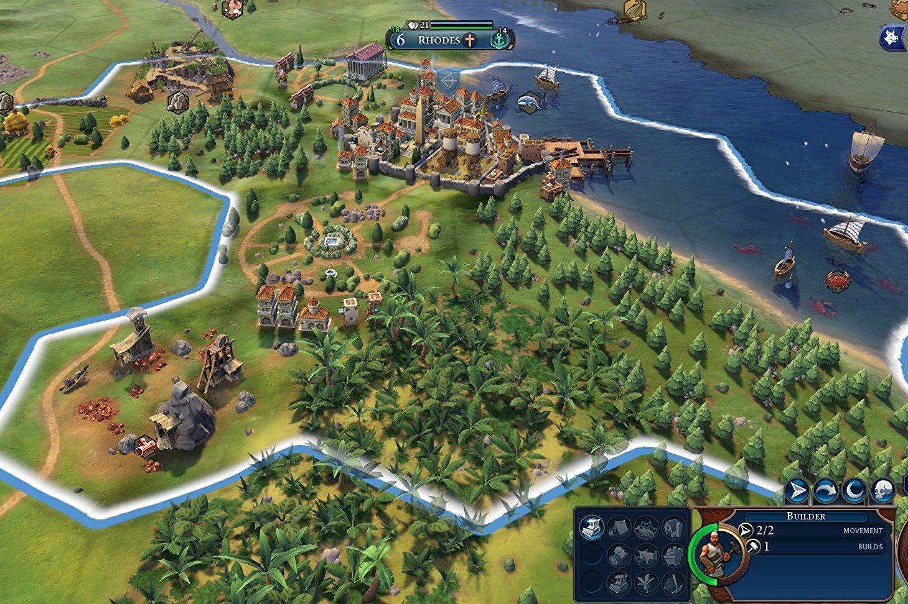
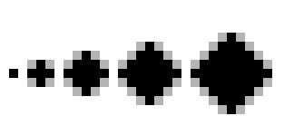
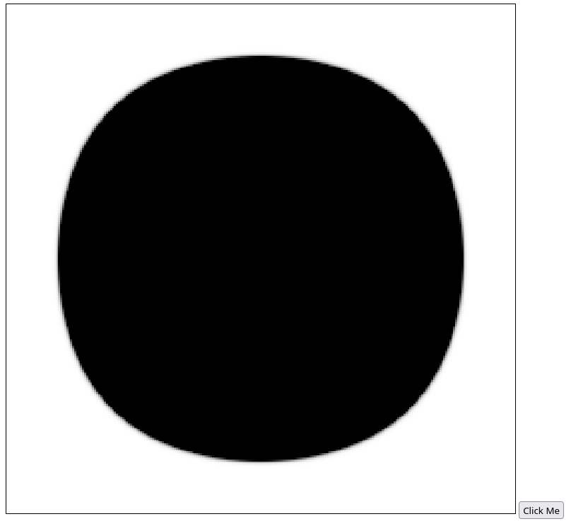
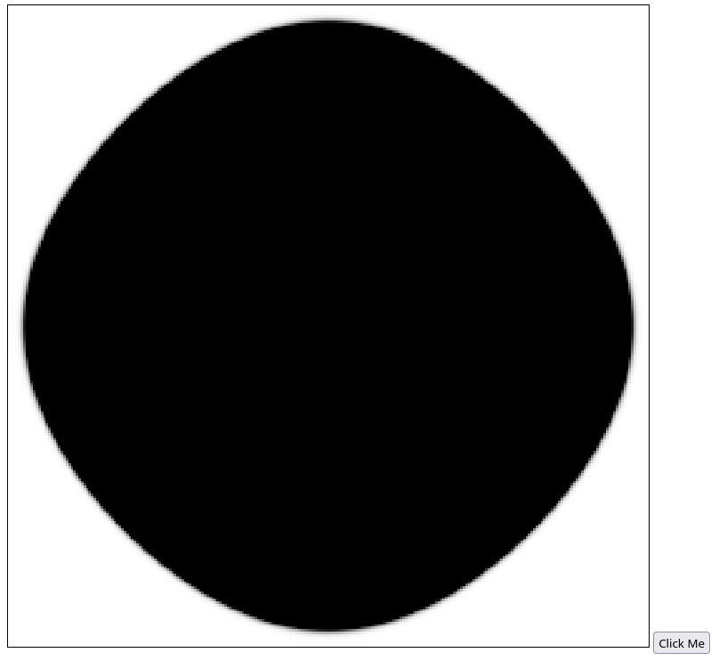

## 引子

好久之间就有想设计一款类似P社类型的战略游戏，最近想了起来，于是便去思索一些基础的设计。其中就遇到了一个有关地块的问题。

对于战棋游戏来说，常见的模拟地图的方法，按照地块形状可分为正方形和正六边形，其中后者的主要代表有《文明：VI》等。而即使对于部分大战略类游戏来说，譬如《灰衣主教》，也是采用的六边形地块。



究其原因，乃是六边形地块相较正方形地块而言有诸多优点：

1. 六边形地块与周围的所有地块均以边相邻，不会出现使用正方形时要纠结顶点相邻的左上角到底如何处理的问题。
2. 六边形是能密铺于平面的最多边形，更加接近圆形；

相应地，六边形地块也存在着一些问题，其几何形状的内角度数为120°，与平面直角坐标系难以兼容，计算复杂且不直观。所以，我想，能否使用正方形来代替六边形的同时，尽量避免一些本身的缺点

## 邻角处理

对于上文中所说的

> 且与周围的所有地块均以边相邻，不会出现使用正方形时要纠结顶点相邻的左上角到底如何处理的问题。

显然，由于六边形到各相邻地块的距离相等，而正方形就不一样了。对于传统战旗类来说，一般有两种处理方法：

1. 只允许玩家上下左右行走
2. 允许玩家于九宫格内八向行走

然而以上两种方法都存在着相同的弊端，如果设正方形边长为 $1$，则斜边长为 $\sqrt{2}$. 如果选择第一种方案，则到达斜边所在地块需要走两步，否则只需要一步，而 $1<\sqrt{2}<2$，这两者无论选哪一个都是与实际情况不符且不公平的。

但是在我的需求当中，并没有要求与实际的棋类一样，一次走一步，一步跨一格，这么量子化。因为对我来说，只要设置一个简单的步长即可，以下面的矩阵为例：

$$
\begin{vmatrix}
A & B\\\
C & D
\end{vmatrix}
$$

假设某人从 $A$ 点到 $B$ 点，耗时 $1$ 日；那么对应地，我们只需将其从 $A$ 点到 $D$ 点的耗时设为 $\sqrt{2}$ 日即可。

## 平滑边界

对于上文中所说的

> 六边形是能密铺于平面的最多边形，更加接近圆形；

显然，对于任意多边形，放到地图上看都是有棱有角，锯齿化太过严重。目前对于这个问题，我的想法是存储的时候按地块存起来，但展示的时候用户看到的其实是已经平滑过的曲线。

此外，如果再考虑上四个顶点，相邻正方形的连线方向其实有八个，比六边形还多了两个，这样反而能够更好得模拟各种边界线。

## 圆形逼近

设想这样一个理想场景：在我们的地图中央有一个国家，记为C。C国人口无限多，但由于某些原因人人想润，而同一时间段内各个方向允许居住的人数有限且相同。如果放开了让他们一直这样润下去，最后他们的居住地的扩散方向，毫无疑问会是一个圆形。

那么，我们应该怎么使用像素地块来模拟这种情况呢？

类似于 [Conway's Game of Life](https://en.wikipedia.org/wiki/Conway%27s_Game_of_Life)，我们可以定义一套规则，例如在下图中，假设其为开始时刻：

$$
\begin{vmatrix}
LT & T & RT\\\
L & C & R\\\
LB & B & RB
\end{vmatrix}
$$

对于下一时刻，此时有两套简单规则供我们选择：

- L, T, R, B 被人群占领
- L, T, R, B, LT, RT, LB, RB 被人群占领

但是，这两种方法均不能逼近圆形：


分别如上图所示，当扩散次数趋于无穷，前者会逼近于倾斜45°的正方形，后者会保留为原来的形状————双方都还是原来的正方形。

此时的我想当然地就会去想增加对步长的计算，由于此处的时间是量子化的，便只能去修改步长了。在同一时间段内，若 $C$ 恰好能到达 $R$，则此时段内 $C$ 恰好走完了 $l_{C \to RT}$ 的 $\frac{1}{\sqrt2}$ 倍的路程，约为 0.707。

描述成算法就是：

> 若 C 此时数值为 1，则下一时刻， L、T、R、B 点数值 $+1$，LT、RT、LB、RB 点数值 $+\frac{1}{\sqrt2}$（数值范围 0~1）。

可惜事与愿违，这样并不能达到想象中的效果：



这样最终依旧是只能成为倾斜45°的正方形，只不过是顶角变钝了，由一个点变成了三个点。

简单思索过后，我发现问题出在突变上：C 此时数值为 1，
若导致下一时刻 L、T、R、B 点数值突变 +1，其实并不能真实反应迁移速度与边界人口的关系。因此，我们需要重新规定规律，改为：

> 若 L、T、R、B、LT、RT、LB、RB 八点数值均为 1，则下一时刻 C 点变为 1.

由此，以及对于要求其连续化的要求，我们可以得到推论：

> 若 Q 此时数值为 $n$，则下一时刻 L、T、R、B 点数值 $+\frac{n}{8}$，LT、RT、LB、RB 点数值 $+\frac{n}{8}\times\frac{1}{\sqrt2}$，其中 $n\in[0, 1]$.

不过再这样下去徒手画图可就撑不住了，所以还是写段代码用 canvas 实现吧，这里我简单用 js 写了个：

```js
const DILUTION = 1 / 8;
const OBLIQUE_STEP = 0.707

const canvas = document.querySelector('canvas');
const context = canvas.getContext('2d');
const button = document.querySelector('button')

const data = Array.from({ length: 255 }, () => Array.from({ length: 255 }, () => 0));
data[127][127] = 255;

function render() {
    const imageData = context.getImageData(0, 0, 255, 255);
    for (let i = 0; i < 255; i++) {
        for (let j = 0; j < 255; j++) {
            imageData.data[(i * 255 + j) * 4 + 3] = data[i][j]
        }
    }
    context.putImageData(imageData, 0, 0)
}

function clampIndex(x) {
    return clamp(x, 0, 254)
}

function clamp(x, min, max) {
    if (x < min) {
        return min;
    } else if (x > max) {
        return max
    } else {
        return x
    }
}

function getData(data, x, y) {
    return data[clampIndex(x)][clampIndex(y)]
}

function update() {
    const thisData = structuredClone(data)
    for (let i = 0; i < 255; i++) {
        for (let j = 0; j < 255; j++) {
            data[i][j] += getData(thisData, i + 1, j) * DILUTION;
            data[i][j] += getData(thisData, i - 1, j) * DILUTION;
            data[i][j] += getData(thisData, i, j + 1) * DILUTION;
            data[i][j] += getData(thisData, i, j - 1) * DILUTION;

            data[i][j] += getData(thisData, i + 1, j + 1) * DILUTION * OBLIQUE_STEP;
            data[i][j] += getData(thisData, i + 1, j - 1) * DILUTION * OBLIQUE_STEP;
            data[i][j] += getData(thisData, i - 1, j + 1) * DILUTION * OBLIQUE_STEP;
            data[i][j] += getData(thisData, i - 1, j - 1) * DILUTION * OBLIQUE_STEP;

            data[i][j] = clamp(data[i][j], 0, 255)
        }
    }
}

button.onclick = () => {
    update()
    render()
}
```

点了几十下按钮之后效果是这样的：



和前面的相比，已经可以说是很圆了。但是仔细观察的话总感觉有点儿别扭。经过测量，实际上，这个圆在 LT、RT、LB、RB 有点突出了。

我对这一现象感到很奇怪，前面的都是经过数学推导计算得出的，按说应该没问题呀，怎么会和实际效果有些偏移呢。

经过一番思考，我发现实际上，正如前文所提到过的：

> 对于下一时刻，此时有两套简单规则供我们选择：
>
> - L, T, R, B 被人群占领
> - L, T, R, B, LT, RT, LB, RB 被人群占领
>
> 但是，这两种方法均不能逼近圆形：
>
> 
>
> 分别如上图所示，当扩散次数趋于无穷，前者会逼近于倾斜45°的正方形，后者会保留为原来的形状————双方都还是原来的正方形。

我们这里采取本质上还是后一种方案。人群最终扩散到达的位置，实际上已经构成了一个大正方形，只是四角的颜色过浅，导致我们看不到罢了。但尽管我们看不到，它实际上还是会对四角产生微弱的影响，导致其四角方向的延伸长度必定多于正圆。

于是，我想如果将斜边权重 `OBLIQUE_STEP` 设为 0 会怎么样呢？结果如下：



果然，四边变得更扁了，但是也扁过头了，依旧不是正圆。

由此，我联想到了几个问题：

- 当 `DILUTION` 即时间段细分趋于无效小时，是否会影响到最终的形状？
- 根据二分法可以猜测，大概率存在一个 `OBLIQUE_STEP`，使得最终形状趋于正圆，那此时 `OBLIQUE_STEP` 会是几呢？（可惜以我的数学能力只能获得逼近值，而无法获得准确值）
- 既然 LT 可以对 T 产生 1 的影响，LT 也可以对 C 产生 $\frac{1}{\sqrt{2}}$ 的影响，那凭什么 LT 就不对 RB 产生 $\frac{1}{2\sqrt{2}}$ 的影响呢？依次类推，一个点可以对图中任意远的点产生影响。正如此刻一只澳大利亚的袋鼠可以对梵蒂冈的教皇产生万有引力，尽管微乎其微，但它确实存在。
- 这个例子从一开始可能就是不恰当的，与其说是人群的迁移，不如比作是信息的传播，因为信息可以无限复制。但这又引入了一个新问题，A 点当前的信息量会对下一刻 A 点本身施加影响吗？

## 结语

今晚文章写了这么多，就先写到这儿吧，毕竟最近网校还有项目要做。上面四条算是给自己挖了一个坑，不知道还这篇文章还会不会有后续（希望能有）。如果有的话，但愿到时候能解决这几个问题。

## 花絮

刚才写着写着突然又想到了一个正方形地块的优点，就是它恰好能够与一些由于殖民等历史原因而划分的区域的横平竖直的边界线相符合，比如埃及西部国境线和美国各州等（虽然说有点瞎猫碰到死耗子的感觉😂）