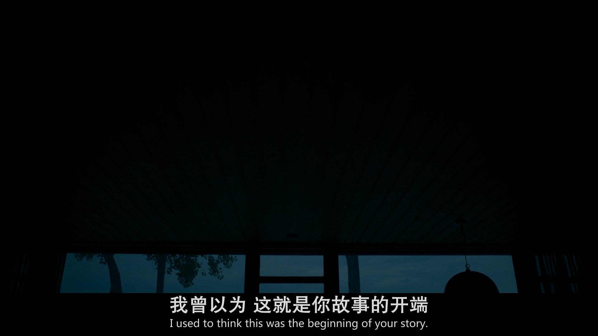
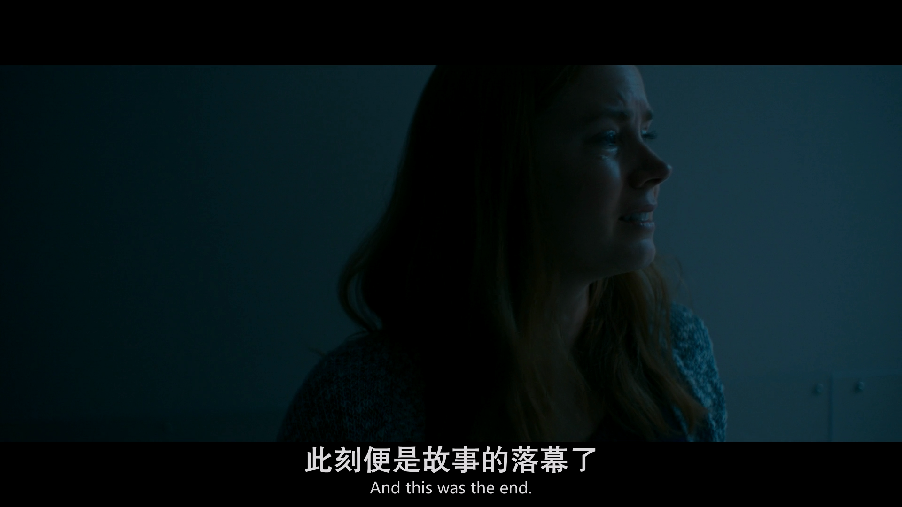
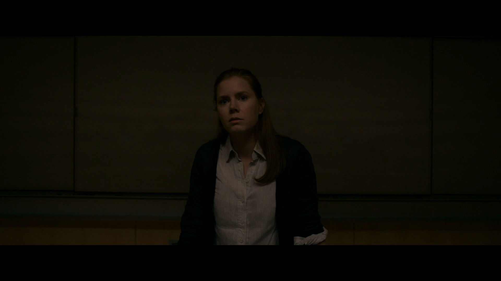
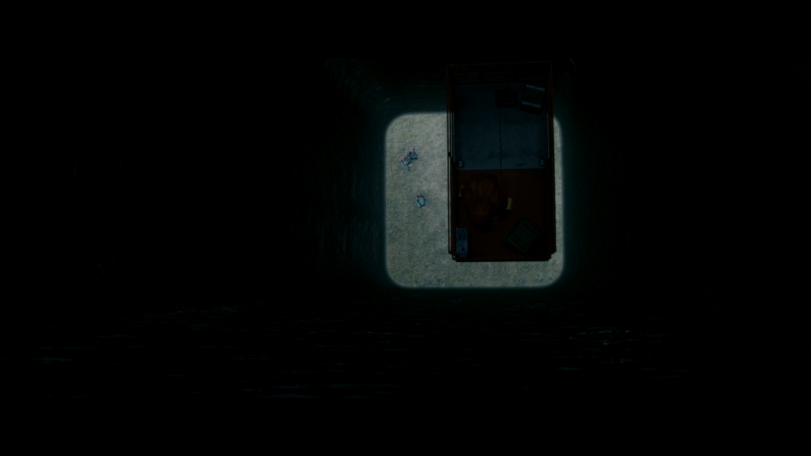
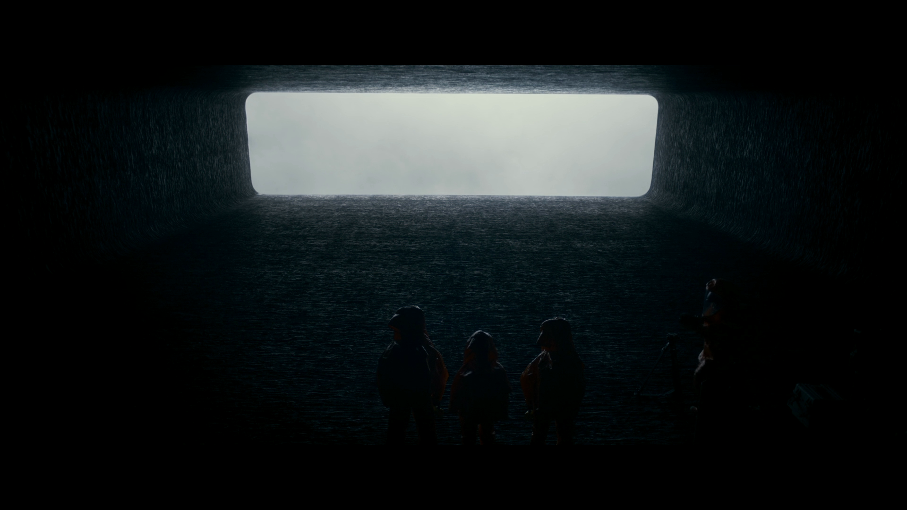
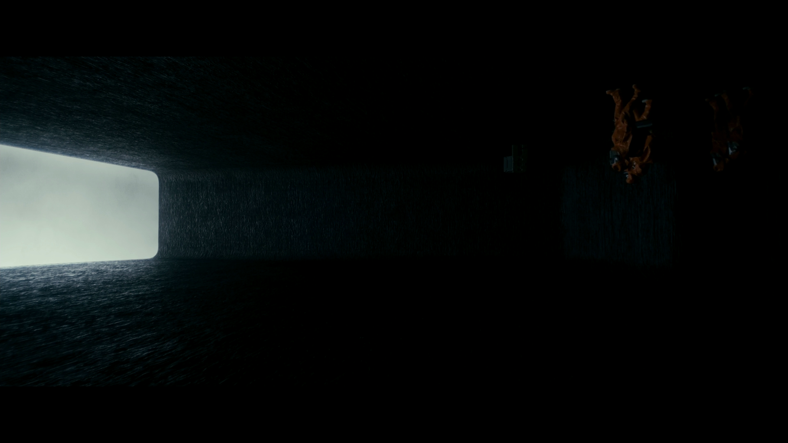
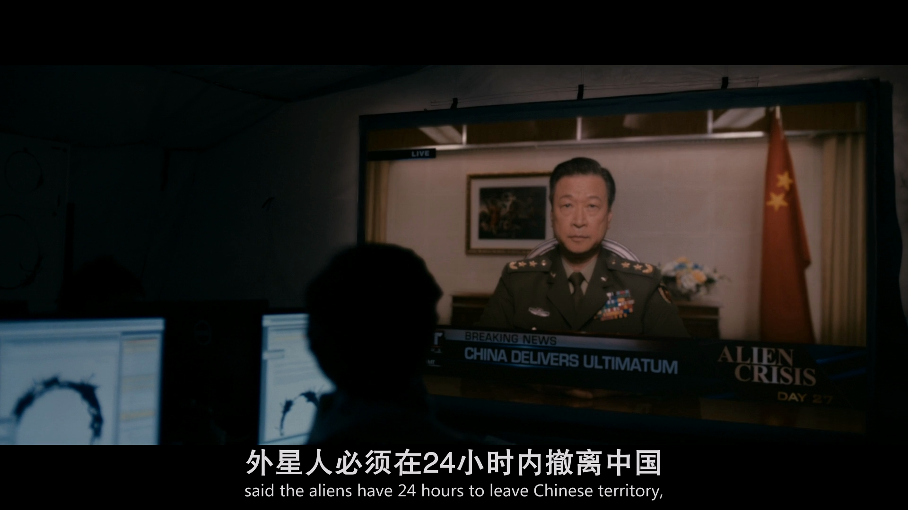

**⚠️警告：本文含有对于《降临》（2016）的部分剧透，请酌情阅读。**

## 引言

最近我一直在研究语言学。在读到一篇有关 Sapir-Whorf Hypothesis 的文章时，看到作者提到了前几年（2016）上映的电影 Arrival（中文译作《降临》），查了一下感觉主题正好和语言学有关，顿生兴趣。于是抽空花了大约两个小时看完了这场电影。

本片改编自美国华裔科幻作家姜峯楠的作品《你一生的故事》，我在观影前没有读过此书，因此本文的分析不会基于本作与原著的对比。

## 片段评述

我写评价一般都是着重写我要批评的地方，但是这里我还是想先顺便提一它的不少可圈可点的部分。

### 一

在叙事结构上，本部影片采用的是单线叙事，中间辅以插叙。影片开头先以女主的倒叙引入，扼要地提到了女主个人未来的生活片段。这种手法，很容易使人联想到著名的《百年孤独》的开头：

> 多年以后，面对行刑队，奥雷里亚诺布恩迪亚上校将会回想起父亲带他去见识冰块的那个遥远的下午。

但实际上而言，该片段基本没有明确的交代或暗示它的发生时间，这一度使我误认为此段是正向叙事，后面的情节都是接在女主在其女儿去世之后的枯燥日常。

### 二

影片在进入女主授课至与外星飞船接触的这段时间内，影片表现得相当克制，自始至终没有向观众展示飞船的外形。即使是外星人的到来这件事本身，影片甚至也是以侧面描写的方式相关展示：而这个侧面描写的实践在我看来相当精妙。

### 三

这部电影不少镜头的拍摄手法，尤其是在 Louise 等人首次进入外星飞船时的部分，对于飞船内部的拍摄，特别是相机的构图与拍摄方向等，实属优异，不少单帧单就美感而言都是能够拿来做壁纸的程度。

## 批评

### 对社会描述的不合理性与传统美式个人英雄主义叙事的批评

这个也算是老调重弹了。好莱坞式的电影往往喜欢将政治或军方的领导者刻画得刚愎自用、急功近利，在剧中像是反派一样，沦落为剧情需要的制造者，创造冲突与故事矛盾，反倒起到了阻碍主角的作用，最后由主角收拾烂摊子，拯救世界于危难之中。这部剧中也是如此，女主正要拯救世界的先要关头，长官却以叛国罪威胁女主，并险些将其与其男友一同枪毙。

在破解 Heptapod 语言的过程中，起主要作用的基本只有女主。曰：

> 天下才有一石，Louise 独占八斗，Ian 得一斗，天下共分一斗。

除了男主和女主正好一个物理学家，一个语言学家，剩下的研究者里，基本都是些喽啰，电影中也基本没有刻画他们的正面作用，仿佛对语言的研究就是主角团两人完成的。

其次，我无法理解，在地球人与外星人科技差距如此之大的前提下（外星人能够做到毫无预兆的出现在地球，并且掌握了反重力技术），人类是怎么敢冒着巨大的不可挽回的有关误读的风险，去直接用着落后的飞机大炮TNT去攻击人家近乎完美椭圆体近乎纯黑色乍一看就根本不在一个科技次元上的飞船的。这完全是无异于自杀行为，拿着全人类的生命作为赌注。

此外关于中国的情节，我不理解怎么电影里中国掌握最高军事权的仅仅就是一位将军。影视完全就是把这位将军当成中国的国家元首与三军统帅来刻画了，要我说，哪怕你不知道中国有总书记这个职位，用个国家主席这个虚位元首都更合理一些。

### Sapir-Whorf Hypothesis 与时间悖论

就一般的科幻而言，其科幻设定往往基于物理学定律，比较特殊的有诸如《三体》，基于现实中的博弈论，作者根据原作中假设的宇宙社会学，提出了黑暗按森林假说。而这次 Arrival 同样独辟蹊径，其底层设定，基于的是语言学中著名的 Sapir-Whorf Hypothesis，又名 Linguistic Reletivity。这项学说认为，人类的思考模式受到其使用语言的影响，因而对同一事物时可能会有不同的看法。常见的影响因素有方向、颜色、时间。

拿我自己举个例子吧：我是北方人。北方相比南方相比有个特点，那就是多平原，从我家乡下向西方望去，是一望无际的华北平原，其间没有山陵的阻隔，均是大片的田地，几乎能一眼望到地平线。南方则多山多丘陵。这两者地理上的差异也造就了南北对于方向用词上的区别，北方多用东西南北，南方则是前后左右。我大学是在南方上学，一次和朋友外出游玩，谈到路线，发现我们双方用词的差异，他惊诧于我为何执着于绝对方向，并好奇我是否会陌生环境迷失方向；而我则疑惑他是如何高速地计算出说话者相对方向，并随着自身的旋转而不厌其烦的适时调整。事实上，正如他所言，我在当时尚且陌生的城市指认了方向，拿出手机的指南针进行确认，其结果果不其然与我所料一致。另外还记得我在小学时和同学们在操场闲聊，共同困惑于指南针存在的意义，认为方向靠直觉即可辨认，何需另靠他物。尽管在现在看来当时实在过于自负，但这也侧面反应了我们当地人对于方向感的掌握上也确实是相对更强一些的。学界也有许多实验对此进行佐证，此不赘述。

本影片中的实际上更像是对 Sapir-Whorf Hypothesis 另一版本 Linguistic Determinism 的科幻式诠释，即语言对于思想有着决定性的影响，可惜的是，这一假说已经基本被当代语言学家所扬弃。因此，对于影片中学会外星语言后就能预知未来，自然是无稽之谈。但就一个科幻文学而言，仍是一个不错的点子。

不可避免地，当一部科幻作品中出现时空穿越或是预知未来的设定为，就难免会触碰到时间悖论。此作中，女主为了给商将军打电话，可是却不知道其电话号码，于是预见了一年半后于商将军的会面，席间商将军将电话号码告诉给了女主，女主记下，并在当下拨通了向商将军的电话。然而就电影中的表现来看，一名半后的女主根本不记得自己曾经打过电话这件事，这与事实相悖，违背了基础的因果律。其次，从理性的角度来说，女主既然已经预言到了在未来已经达成和平，为何当下还这么匆匆忙忙呢（除非预言是可以被人为更改的，那这样的话，当许多人都能预言，同时他们也都具有主观能动性，那么预言也就没有意义了，因为它们可以随时改变），观众同样因此被告知了结局，这是否会对悬念的营造产生干扰呢？

## 总评

脱离于传统物理学的新颖的科幻设定，优秀的镜头语言与含蓄的表达手法，语言学相关加分项。科幻设定基础薄弱，理论不自洽，结尾留白叙事把握较差导致意犹未尽等减分项。

总评，四星（五星制）。