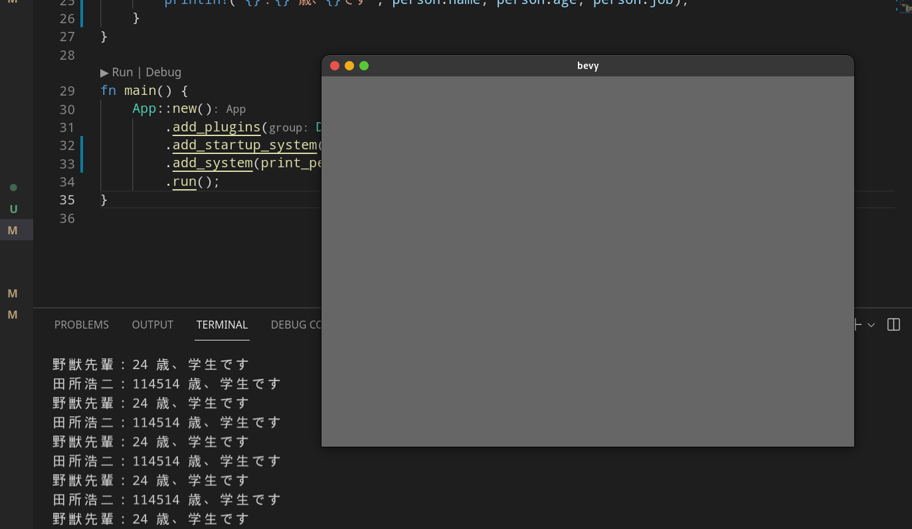
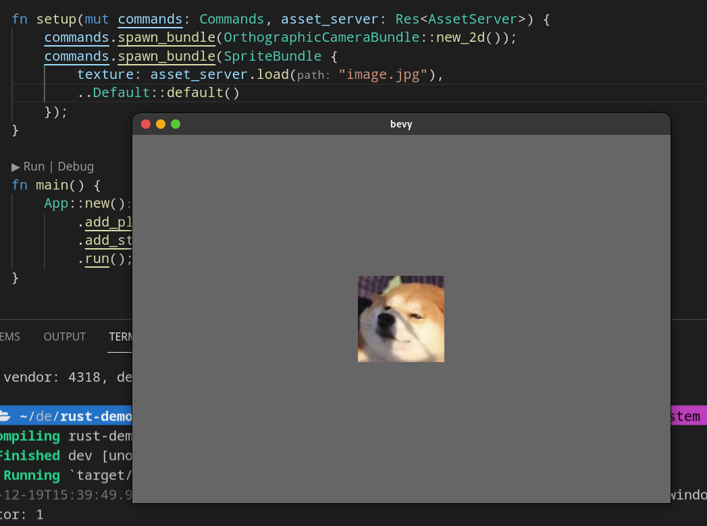

## 一些碎碎念

### 年轻人的第一款开源游戏引擎：Godot

许久以前就一直有做游戏的想法。中学时或多或少地接触或听说过 CocosCreator、Erget、Unity 和 Unreal
等著名引擎，然而这些都是商业引擎，且对我来说太过笨重。大一的时候听说了
Godot，得知它应该是当前世界范围内最完善，也是知名与流行度最广的开源游戏引擎了。而且体积极其精简，只有不过百兆；与其他大型引擎动辄几 GB
的体积相比，实属一股清流。于是深得我心，我后面也开始学习这款引擎。

这款引擎主要面向的应该是独立游戏开发者，预设了开发者技术能力不强的立场，同时也是为了使更多人接触到游戏开发，所以内置的官方语言是一门叫做 GDScript
的脚本语言，语法极其类似 Python。同时为了秉持开放性，也提供了 GDNative 供开发者使用几乎是任意语言（如 C/C++/Rust 等）进行开发。

首先谈一下这个 Python，哦不，是 GDScript，我个人其实并不是很喜欢这门语言，简要列举一些原因：

- 个人不喜欢 Python 的缩进语法
- GDScript 语言本身过于小众（但小众本身不是原罪），适用范围狭窄，语法设计拉跨，不够优雅
- 性能拉跨，之前看过测试速度比 Python 还慢

当然 Godot 也可以通过 GDNative 使用我最喜欢的 Rust。但是中间终究隔着一层转译层，如同隔着一层可悲的厚壁障（什么奇妙比喻？）。其次,
Godot 本身使用的 Node 架构也会带来一定性能上的问题,参见官方文档：

> **When and how to avoid using nodes for everything**
>
> Nodes are cheap to produce, but even they have their limits. A project may
> have tens of thousands of nodes all doing things. The more complex their
> behavior though, the larger the strain each one adds to a project's
> performance.
>
> (https://docs.godotengine.org/en/stable/getting_started/workflow/best_practices/node_alternatives.html)

那么问题来了：

> 你就一臭做独游的，还考虑个锤子性能？

话虽如此，可有哪个开发者能拒绝对性能的追求呢？再者，开发体验对我来说才是它更大的痛点。

### 从 Godot 园到 Bevy 书屋

后来，我又不知道在哪看到了 Bevy 这个游戏引擎。一开始没怎么注意它，最近见我加的一个 Godot 游戏开发的群组也时而提到它，但开始对它再次萌生好奇之心。

印象里，Rust 里面之前比较火的开源游戏引擎有两个，一个 [Amethyst](https://github.com/amethyst/amethyst)
和一个 [Bevy](https://github.com/bevyengine/bevy)。看 Bevy 之前特意也查了下
Amethyst，发现它已经处于近乎停止维护的状态了；又去翻了一下它的论坛，发现里面也有一些谈到 Bevy
的优秀特性的帖子，遂不禁唏嘘。不过同时，这也坚定了我转向 Bevy 的决心，为下文中与 Bevy 的邂逅埋下了伏笔（阅读理解后遗症了属于是）。

总之，接触到 Bevy 后不久，我就确定全面转向它了。它吸引我的地方实在太多，再简单列几条：

- Open Source, Free(自由) & Free(免费)
- 源码与开发语言均为我最喜欢的 Rust（JS 谁啊，不是很熟🤔）
- 采用新潮的 ECS 架构，天生并发友好，性能优异
- 对原生工具链友好，如 VSCode/Cargo 等
- ~~它作者本人也很让我喜欢👀~~

话不多说，赶紧进入我们今天的正题，Bevy 的基础教程吧

（本文假定你已经有一定的 Rust 语法基础，对其使用上的语法细节不会过多讲解）

## ECS 架构扫盲

> 什么呀，ECS，我知道，不就是阿里云的那个云服务器吗，好像全称是什么弹性计算服务（Elastic Compute Service）？

少年，莫急，此 ECS 非彼 ECS，这里的 ECS，指的是：`Entity-Component-System`。

ECS 是相对于传统的 OOP 思想而言的，遵循“组合大于继承”的原则。在 ECS 架构的游戏中，游戏单元由无数的 `Entity` 构成，其中
`Entity` 可类比做常见编程概念中的实例。而每个 `Entity` 则由多个或单个 `Component` 组成，`Component`
是存储数据的结构类型，不包含任何方法。如果想要更新游戏数据，则需要通过 `System` 来完成。

如果需要进一步介绍，可自行百度/谷歌。

光说不练略显抽象，还是一起来看下面的代码吧：

## 使用 Bevy 实现简单的 ECS 架构

Bevy 是一款基于 ECS 架构的游戏引擎，它的官网上就这么写道：

> Massively Parallel and Cache-Friendly. The fastest ECS according to some
> benchmarks

简单翻译下就是：大规模并行&缓存友好，据某些测评说是最快的 ECS 游戏引擎

因此，接下来我们就使用 Bevy 来实践一下 ECS：

```bash
cargo new bevy-demo
cd bevy-demo
```

修改 `Cargo.toml`：

```toml
[package]
name = "bevy-demo"
version = "0.1.0"
edition = "2021"

[dependencies.bevy]
git = "https://github.com/bevyengine/bevy"
rev = "11f52b8c72fc3a568e8bb4a4cd1f3eb025ac2e13"
features = ["dynamic"]
```

注意，这里没有使用 crate.io 上的最新版 0.5.0，而是使用了其 Github 上的最新版。原因是 0.6.0 发布在即（估计还有几个月），当前版本与
0.5.0 的用法已经存在较大差异。所以直接使用较新的版本也可以降低今后的学习成本。

请确保你的配置中 `rev` 与此处相同。本文所基于的版本为 Github 上 2021-12-18 的最新提交。

`features` 中的 `dynamic` 是用于加快构建速度的，但是当你正式发布 Release
时最好去掉此特性，至于为什么，你可以自己去观察下当开启或关闭此特性后的生成的编译产物分别是什么。

简简单单一个 Hello World 级别的主文件(`main.rs`)：

```rust
use bevy::prelude::*;

fn main() {
    App::new().run();
}
```

跑起来试试

```
cargo run
```

啥输出也没有，正常预期。

接下来再加上点 ECS 架构：

首先，定义 `Component`：

```rust
#[derive(Component)]
struct Person {
    name: String,
    job: String,
    age: u32,
}
```

写一个创建 `Entity` 的 `System`（函数）：

```rust
fn init_people(mut commands: Commands) {
    commands.spawn().insert(Person {
        name: "野獣先輩".to_string(),
        job: "学生".to_string(),
        age: 24,
    });
    commands.spawn().insert(Person {
        name: "田所浩二".to_string(),
        job: "学生".to_string(),
        age: 114514,
    });
}
```

接着再写一个遍历所有 `Entities` 并输出的 `System`（函数）：

```rust
fn print_people(query: Query<&Person>) {
    for person in query.iter() {
        println!("{}：{} 歳、{}です", person.name, person.age, person.job);
    }
}
```

接下来我们就要把这些东西整合起来，也就是添加到 `main()` 中的 `App` 上。

这里要先介绍 `App` 的两个方法，`add_system()` 和 `add_startup_system()`。`add_system()`
顾名思义，就是用来添加 `system` 到 `App` 上的；而 `add_startup_system()`，则是会在游戏初始化阶段也就是最开始执行某个
`system`。因此，我们可以把主函数改成这样：

```rust
fn main() {
    App::new()
        .add_startup_system(init_people)
        .add_system(print_people)
        .run();
}
```

执行 `cargo run`，输出结果是：

```
$ cargo run
   Compiling rust-demo v0.1.0 (/home/lomirus/demo/rust-demo)
    Finished dev [unoptimized + debuginfo] target(s) in 3.03s
     Running `target/debug/rust-demo`
野獣先輩：24 歳、学生です
田所浩二：114514 歳、学生です
```

## Bevy 基础开发

有些小伙伴可能会问了：

> 正经人谁玩控制台黑框框游戏呀？

确实，Bevy 毕竟也不是用来写 CLI 的。所以接下来我们再实现一个简单的图形界面。

### 准备资源

首先，在项目目录创建一个 `assets` 文件夹，在里面放一张图片。比如我放了一张 `image.jpg` 进去，但是这里要注意，bevy 默认是不支持载入
jpg 格式的图片的，这时需要修改一下 Cargo.toml

```toml
[dependencies.bevy]
git = "https://github.com/bevyengine/bevy"
rev = "11f52b8c72fc3a568e8bb4a4cd1f3eb025ac2e13"
# features = ["dynamic"]
features = ["jpeg", "dynamic"]
```

这样就可以支持载入 jpg 格式的图片了。

然后，再在 `assets` 文件夹下创建一个字体文件。由于我是 Linux 用户，所以直接复制了一份系统自带的
`NotoSansMono-Regular.ttf` 字体。这里你当然也可以选自己喜欢的，记得后面的相应操作改成你的字体名就行。

### 创建窗口

Bevy 的设计是很模块化的，许多功能都被拆成了不同的模块，利用添加插件的形式使用。不过幸好 Bevy 也为我们提供了默认的插件配置。比如我们可以使用：

```rust
App::new()
    .add_plugins(DefaultPlugins)
    .add_startup_system(init_people)
    .add_system(print_people)
    .run();
```

以此导入默认插件，然后我们运行，会发现控制台不断输出内容，同时也弹出了一个窗口：



这就说明添加成功了，至于控制台里会出现无限输出的现象，是因为添加 `DefaultPlugins` 的时候，同时也引入了 eventloop。

### 载入图片

现在我们之前写的函数都可以扬了，再重新创建一个新的 `main` 函数：

```rust
fn main() {
    App::new()
        .add_plugins(DefaultPlugins)
        .add_startup_system(setup)
        .run();
}
```

接下来我们将在 `setup` 函数中实现载入图片的逻辑：

```rust
fn setup(mut commands: Commands, asset_server: Res<AssetServer>) {
    commands.spawn().insert_bundle(SpriteBundle {
        texture: asset_server.load("image.jpg"),
        ..Default::default()
    });
}
```

这就就添加了图片到游戏里面，但是我们并看不到图片，原因是我们没有添加摄像头，所以接下来我们再添加一个“正交相机”：

```rust
commands.spawn().insert_bundle(OrthographicCameraBundle::new_2d());
commands.spawn().insert_bundle(SpriteBundle {
    texture: asset_server.load("image.jpg"),
    ..Default::default()
});
```

此外，`spawn().insert_bundle(bundle)` 还可以简化成 `spawn_bundle(bundle)`，所以上面的代码可以改成：

```rust
commands.spawn_bundle(OrthographicCameraBundle::new_2d());
commands.spawn_bundle(SpriteBundle {
    texture: asset_server.load("image.jpg"),
    ..Default::default()
});
```

运行看看效果：



### 读取键盘输入

为 `App` 增加读取键盘输入的系统：

```rust
App::new()
    .add_plugins(DefaultPlugins)
    .add_startup_system(setup)
    .add_system(keyboard_input_system)
    .run();
```

下面编写 `keyboard_input_system` 函数：

```rust
fn keyboard_input_system(keyboard_input: Res<Input<KeyCode>>) {
    if keyboard_input.pressed(KeyCode::A) {
        println!("Go Left!");
    }
    if keyboard_input.pressed(KeyCode::D) {
        println!("Go Right!");
    }
}
```

接下来运行一下，按下键盘的 `A` 和 `D` 键，便会看到控制台出现相应的输出。另外此处的 `keyboard_input` 常用的方法还有两个 `just_pressed()` 和 `just_released()`，它们各自具体的用途可以自己分别试一下，看看是什么效果。

### 角色移动

为了更加使函数名更加语义化，我们先把 `keyboard_input_system()` 改成 `move_system()`，然后修改函数：

```rust
fn move_system(
    keyboard_input: Res<Input<KeyCode>>,
    mut players: Query<&mut Transform>,
) {
    if keyboard_input.pressed(KeyCode::A) {
        for mut player in players.iter_mut() {
            player.translation.x -= 1.0;
        }
    }
    if keyboard_input.pressed(KeyCode::D) {
        for mut player in players.iter_mut() {
            player.translation.x += 1.0;
        }
    }
}
```

由于我们的在之前的 `setup` 中添加的 `SpriteBundle` 中含有 `Transform` `Component`，所以这里会获取到所有的 `Transform`。然后我们对它遍历，并修改它的 `translate` 属性，如果用户按 `A` 则角色向左移动，按 `D` 则向右移动。

如果现在你试着运行，你会发现按键后角色并没有移动。之所以这样，是因为我们前面还添加了一个“正交相机”，它也具有 `Transform` 组件。而根据著名的锡进定律，我们易证：

> 所有组件都移动了，就等于所有组件都没移动。😅

这里体现了运动的相对性，由于相机和角色是一起移动的，所以在相机看来，角色相当于就是没有移动。

为了解决这个问题，我们需要再给角色添加一个特殊的组件（`Component`）：

```rust
#[derive(Component)]
struct Player;
```

接着再向角色实体 `Entity` 添加上该 `Component`：

```rust
fn setup(mut commands: Commands, asset_server: Res<AssetServer>) {
    commands.spawn_bundle(OrthographicCameraBundle::new_2d());
    commands
        .spawn_bundle(SpriteBundle {
            texture: asset_server.load("image.jpg"),
            ..Default::default()
        })
        .insert(Player);
}
```

最后再修改一下角色移动系统，要求查询（`Query`）到的角色需要含有 `Player` 组件：

```rust
fn move_system(
    keyboard_input: Res<Input<KeyCode>>,
    mut players: Query<&mut Transform, With<Player>>,
) {
    if keyboard_input.pressed(KeyCode::A) {
        for mut player in players.iter_mut() {
            player.translation.x -= 1.0;
        }
    }
    if keyboard_input.pressed(KeyCode::D) {
        for mut player in players.iter_mut() {
            player.translation.x -= 1.0;
        }
    }
}
```

接下来运行一下，角色就可以移动起来了。

另外，由于这里的玩家只有一个，我们可以把 for 循环给去掉，简化一下：

```rust
fn move_system(
    keyboard_input: Res<Input<KeyCode>>,
    mut players: Query<&mut Transform, With<Player>>,
) {
    if keyboard_input.pressed(KeyCode::A) {
        players.iter_mut().next().unwrap().translation.x -= 1.0;
    }
    if keyboard_input.pressed(KeyCode::D) {
        players.iter_mut().next().unwrap().translation.x += 1.0;
    }
}
```

另外的另外，这里除了修改实体外，你也可以把玩家定义为全局唯一的资源类，这里就不再演示了。

## Next Steps

Bevy 的进一步学习建议阅读[官方示例](https://github.com/bevyengine/bevy/tree/latest/examples)

至于我自己，除了学习游戏引擎，我觉得也该去先学点画画了😥毕竟我的 Aseprite 都不知道吃灰多久了


