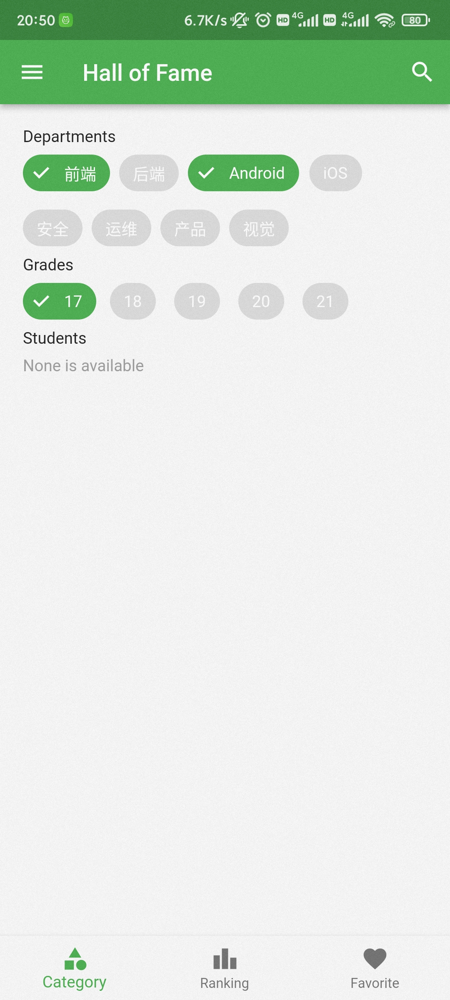

## 前言

首先简要介绍一下 `Hall of Fame` 吧，这其实就只是我自己开发的一个用于管理、分发我的一些朋友们的聊天记录截图表情包的 App。本来是想着和朋友合作，自己只负责后端开发来着，然而负责 Android 和 Web 客户端开发的那边一直还有其他需求，导致这边的工期一直在鸽。到了后面，我就接手的这个项目的客户端方面的开发，然而上面的其实并不是主要原因。主要还是因为最近我对 Flutter 这种大前端的技术栈比较感兴趣，想要学习一下。而且这个 App 的复杂度又恰到好处，因此就正好使用它来练手了。

总的来说，Flutter 的上手难度在我个人角度看来还算是比较简单的。从从未接触过 Flutter，到独立开发出一个相对完整的 App，中间也不过只有两周左右。另外从一名 Web 前端开发者的视角来看，使用 Flutter 开发界面的难度还是要相对高于传统的 Web 开发的，尤其是在自定义方面，一旦写起样式来各种嵌套又要写一堆了...但是 Google 默认提供的 Material Design UI 库对于没有视觉要求的指定风格的情况来说还是蛮够用的；另外官方也提供了一套 iOS 风格的 Cupertino UI 库，但是我还没有尝试过这个，不知道实际体验效果如何。至少就此来看，使用 Flutter 来进行一款跨端的小品类应用开发确实是一项不错的选择。至于大型项目，虽然 Flutter 版本已经迭代到了 2.5+，但是相对于其他已经发展了数年的 Native/Web 开发方案来说，还不能说是特别成熟。就比如我在下文中提到的一些坑，至今官方还没有提供相应的瀑布流库。闲鱼对此选择的路线则是自研，不过我种初学者自然是没有人家这种专业团队的实力，于是只能乖乖的在社区里找一些开源库先用着。

至于性能方面，就我的 Hall of Fame 而言，采用 Release 模式下在 Android 平台上是几乎感受不到与 Native App 的差距的，包括我的做 Android 开发的朋友对此也是赞叹有加。另外说来离谱，在 Linux 环境下，用 C++ 编译成原生 Linux 二进制的可执行程序的动画性能，是肉眼可见地低于在 Linux 平台下 Chrome 上的性能的。Linux 原生程序运行时可以明显的看到掉帧，而在 Windows 和 Chrome 上则比较流畅。

下面贴下这个项目的 Github 地址：[https://github.com/hall-of-fame/hof-flutter-md](https://github.com/hall-of-fame/hof-flutter-md)，以及首屏图：



下面则是讲一下我在使用 Flutter 进行开发的过程中遇到的一些问题：

## 导航栏标签页 keep-alive

### 一般的标签页切换

在 Flutter 中，如果我们想通过 BottomNavigationBar 实现一个简单的标签页切换功能，可以在官方文档对于
`BottomNavigationBar class` 的介绍看到一些简单示例。这里我们以之为基础，再次对其进行简化，可以得到下面一个只有 32 行的简单结构：

```dart
class MyStatefulWidget extends StatefulWidget {
  const MyStatefulWidget({Key? key}) : super(key: key);
  State<MyStatefulWidget> createState() => _MyStatefulWidgetState();
}

class _MyStatefulWidgetState extends State<MyStatefulWidget> {
  int _selectedIndex = 0;
  static const List<Widget> _widgetOptions = <Widget>[
    Text('Index 0: Home'),
    Text('Index 1: Settings'),
  ];
  
  Widget build(BuildContext context) {
    return Scaffold(
      body: Center(child: _widgetOptions.elementAt(_selectedIndex)),
      bottomNavigationBar: BottomNavigationBar(
        items: const <BottomNavigationBarItem>[
          BottomNavigationBarItem(
            icon: Icon(Icons.home),
            label: 'Home',
          ),
          BottomNavigationBarItem(
            icon: Icon(Icons.settings),
            label: 'Settings',
          ),
        ],
        currentIndex: _selectedIndex,
        onTap: (int index) => setState(() => _selectedIndex = index),
      ),
    );
  }
}
```

### 问题引入：无法保存组件状态

事实上，对于上文中的[最小样例](#最小样例)，这么写是完全没有问题的。但是随着软件功能的复杂化，一些问题可能就会暴露出来。比如，我们将上文中的 `Text`
组件换为 `TextField` 标签试一下：

```dart
class MyStatefulWidget extends StatefulWidget {
  const MyStatefulWidget({Key? key}) : super(key: key);
  State<MyStatefulWidget> createState() => _MyStatefulWidgetState();
}

class _MyStatefulWidgetState extends State<MyStatefulWidget> {
  int _selectedIndex = 0;
  static const List<Widget> _widgetOptions = <Widget>[
    TextField(),
    TextField(),
  ];
  
  Widget build(BuildContext context) {
    return Scaffold(
      body: Center(child: _widgetOptions.elementAt(_selectedIndex)),
      bottomNavigationBar: BottomNavigationBar(
        items: const <BottomNavigationBarItem>[
          BottomNavigationBarItem(
            icon: Icon(Icons.home),
            label: 'Home',
          ),
          BottomNavigationBarItem(
            icon: Icon(Icons.settings),
            label: 'Settings',
          ),
        ],
        currentIndex: _selectedIndex,
        onTap: (int index) => setState(() => _selectedIndex = index),
      ),
    );
  }
}
```

如果你试着跑了一下上文的代码，你会发现代码依旧可以通过编译，也可以正常运行。但是如果你在其中一个 `TextField`
输入了一段文字，然后点击底部导航栏切换到了另一个标签页，然后再切换回来，你会发现你之前在 `TextField` 的内容已经被清空掉了。

这是因为，当你切换到另一个标签页时，Flutter 会将原先的标签页的组件给销毁掉，并创建一个新的你所选择的标签页（或者说是组件）。当你返回原来的页面时，也会执行一遍同样的操作，这时，这个页面已经不是原来的那个页面了。

如果我们使用是的 React (Native) 或者是 Vue，我们可以简单地通过 `<keep-alive>` 标签达到状态保存的目的，但是 Flutter 似乎就没有这么方便了😥。

### 解决方案：Automatic Keep Alive Client Mixin

于是然后我在 Google, StackOverflow, Github 上的一番求索，最终所找到的解决方案，都还是不太完善，比如可能会触发组件多次不必要的重新渲染，使用 Stack & Opacity 隐藏组件导致性能问题等等。最后，反而是在俄语课课间休息摸鱼时在知乎上找到了一个[解决方案](https://zhuanlan.zhihu.com/p/61458683)。

这个方案使用的是 `AutomaticKeepAliveClientMixin`，按照它的方法，对上文中的示例代码进行修改后可得：

```dart
class RootScreen extends StatefulWidget {
  _RootScreenState createState() => _RootScreenState();
}

class _RootScreenState extends State<RootScreen> {
  PageController _pageController = PageController();
  int _pageIndex = 0;

  Widget build(BuildContext context) {
    return Scaffold(
      body: PageView(
        children: <Widget>[
          HomeScreen(),
          SettingsScreen(),
        ],
        controller: _pageController,
        onPageChanged: (index) => setState(() => _pageIndex = index),
      ),
      bottomNavigationBar: BottomNavigator(
        selectTab: (index) => _pageController.jumpToPage(index),
        selectedIndex: _pageIndex,
      ),
    );
  }
}
```

以其中的 `HomeScreen` 为例：

```dart
class HomeScreen extends StatefulWidget {
  _HomeScreenState createState() => _HomeScreenState();
}

class _HomeScreenState extends State<HomeScreen>
    with AutomaticKeepAliveClientMixin {
  bool get wantKeepAlive => true;

  Widget build(BuildContext context) {
    super.build(context);
    return Center(child: Text("Home"));
  }
}
```

即可。

Ref:
[Flutter Case Study: Multiple Navigators with BottomNavigationBar](https://medium.com/coding-with-flutter/flutter-case-study-multiple-navigators-with-bottomnavigationbar-90eb6caa6dbf)

## 瀑布流展示

### Scrollable View 嵌套

当我们尝试在可滚动 View（如ListView/GridView ）中的 children 中嵌套可滚动 View 时，会出现以下报错：

```
════════ Exception caught by rendering library ═════════════════════════════════
The following assertion was thrown during performResize():
Vertical viewport was given unbounded height.

Viewports expand in the scrolling direction to fill their container. In this case, a vertical viewport was given an unlimited amount of vertical space in which to expand. This situation typically happens when a scrollable widget is nested inside another scrollable widget.

If this widget is always nested in a scrollable widget there is no need to use a viewport because there will always be enough vertical space for the children. In this case, consider using a Column instead. Otherwise, consider using the "shrinkWrap" property (or a ShrinkWrappingViewport) to size the height of the viewport to the sum of the heights of its children.
```

这时我们在内层的 View 中可以插入 `shrinkWrap: true`，即可解决报错。但是此时这个 View 将会无法滚动，我们可以继续在后面插入：
`physics: NeverScrollableScrollPhysics()`，即可完美解决以上问题。

### flutter_staggered_grid_view 库的简单使用

[flutter_staggered_grid_view](https://pub.dev/packages/flutter_staggered_grid_view) 是一个可以便捷实现瀑布流布局的 Flutter 库。一般地，要想使用它，我们需要首先导入：

```yaml
### file: pubspec.yaml

dependencies:
  // ...
  flutter_staggered_grid_view: ^0.4.1
```

```dart
/// file: your_widget.dart

import 'package:flutter_staggered_grid_view/flutter_staggered_grid_view.dart';
```

由于官方文档比较残缺，所以这里简要记录一下对于“内部组件宽度相同、数量不定的纵向瀑布流”的实现：

```dart
return ListView(
  padding: EdgeInsets.all(20),
  children: [
    // 此处省略部分固定且无关的组件...
    StaggeredGridView.countBuilder(
      // 横向分两个“比例”
      crossAxisCount: 2,
      // 防止嵌套 Scrollable View 导致报错
      physics: NeverScrollableScrollPhysics(),
      // 防止本例中的 ListView 无法滚动
      shrinkWrap: true,
      // 样式相关
      mainAxisSpacing: 4.0,
      crossAxisSpacing: 4.0,
      // 组件的数量，不填会一直调用 itemBuilder 并不断抛出异常
      itemCount: filtedStickers.length,
      // 对于给定的 index，返回对应组件实例
      itemBuilder: (context, index) =>
          StickerCard(filtedStickers[index]),
      // 对于给定的 index，返回对应组件的宽度占比（相对于 crossAxisCount）
      staggeredTileBuilder: (index) => const StaggeredTile.fit(1),
    ),
  ],
);
```
