## 重庆

今年四月末，我罕见地外出学校走了走。

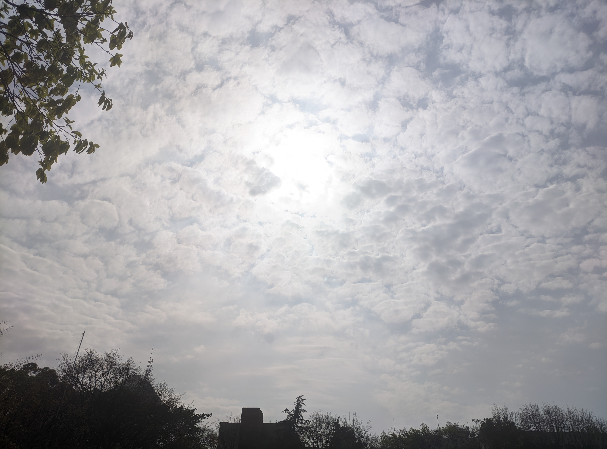

自从进入大学，我在重庆已经待了将近三年了。不过这三年来，我基本都是待在学校里，除了和偶尔几次朋友团建、寒暑假回家之外，印象里从来还没有下过山。不过一想到不久之后，我可能就要离开重庆，去往某座尚未可知的城市了，不免觉得有些遗憾。

于是我决定该出门看看了。

在写这篇文章的时候，已是九月了。我今天已经记不太清当时的感受。现在想来，也无非就是出门闲逛几圈，再拍几张照片，甚至除去公交和地铁外，都没有额外的花费。哦对了，说到地铁，值得一提的是，这还是我人生中第一次使用地铁。但是有趣的是，我似乎对它并没有什么陌生感，尽管是第一次坐，却仿佛是轻车熟路。

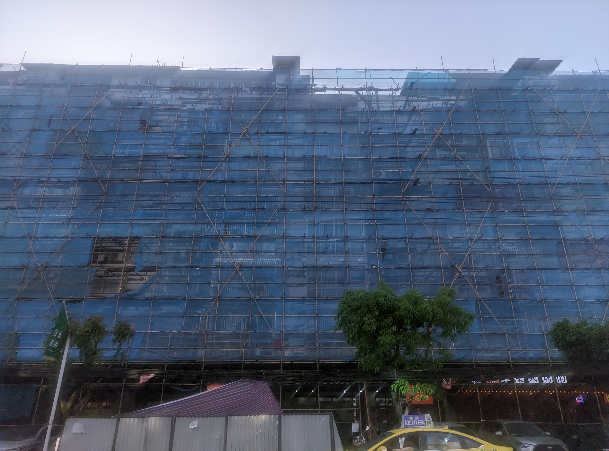

来重庆之前，我对重庆的印象就是，一座普通的二线城市，饮食喜辣。除此以外，并没有过多的了解，至于所谓“山城”，我并不确定在我来之前是否已经对此有了足够的认识。而三年后，我对重庆新增的印象，除了几处耳熟能详却又几乎从未涉足的地点（观音桥、解放碑、洪崖洞），地势纵差明显之外，似乎也没有什么特别的印象。在后续面试腾讯的过程中，我记得在 HR 面的环节，面试官曾经问过我是否喜欢深圳。我的回答是，我对深圳没有什么特别的偏好，实际上，我对任何城市都没有特别的偏好，每个城市对我而言基本上没有什么明显的不同，像是气候什么的，在我的视角来看，基本上是属于无足轻重的层级。

但是话说回来，重庆的地势纵差这一点，暂且不谈日常居住是否方便，至少从旅游的视角来看，我认为这是很难得的。我向来喜爱赛博朋克的艺术风格以及相关作品。倘若让我评出最符合赛博朋克的艺术风格的城市，除去东京、香港、首尔之外，我认为重庆也是不遑多让。我之前曾在网络上看到过洪崖洞的照片，其夜晚华丽的霓虹灯，确实很难让人不想起夜之城夜晚的绚丽灯光以及《千与千寻》中古朴而魔幻的东亚建筑。我这次出游其实是分成了好几天，而大概是在最后的一天，我将目的地设定为了洪崖洞。但可惜，我挑的时间不够好，到了后面，时间上其实已经来到了五一假期，街上的游人熙熙攘攘。我背包里带着艾伦·金斯堡的《嚎叫》，本幻想着在雨夜下的公交亭或是什么地方，静静地欣赏这部来自“跨掉的一代”的诗人的长诗。但是最终，没有什么所谓的雨夜，有的只是嘈杂的游客，充斥着夏日的燥热。终而未得一览，只得悻悻离去。

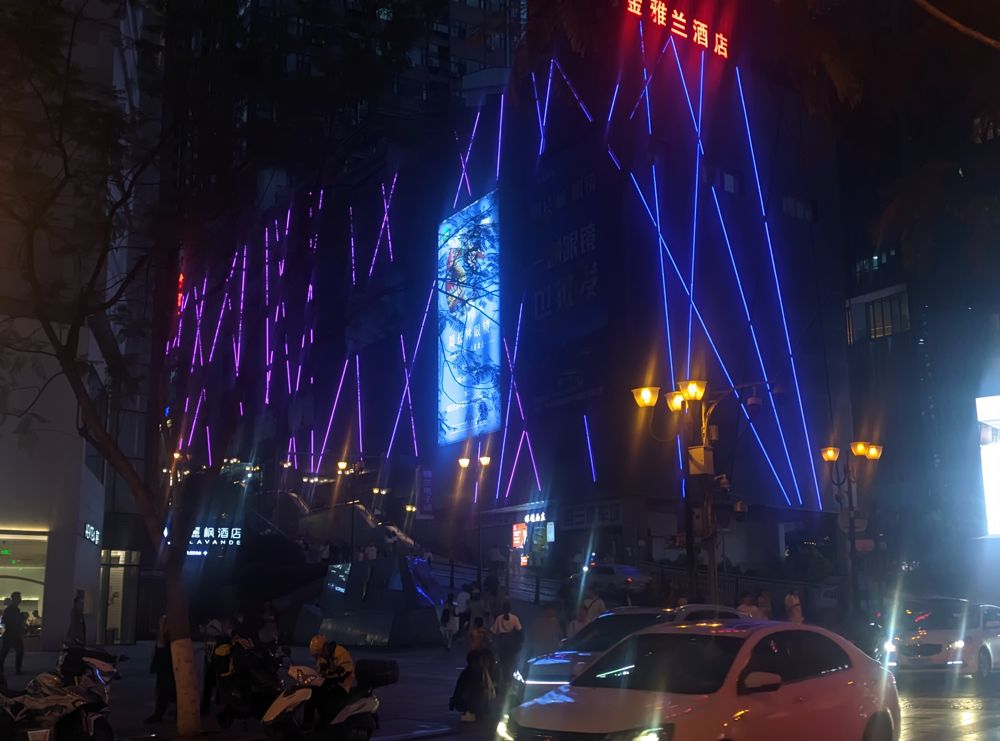

这便几乎是我对重庆的最后记忆，随后不久，大概两周之后，我便踏上了前往另一座城市的航班。

## 深圳

### 初至

就在前文之后不久，我拿到了腾讯的实习 offer，随后便去往了深圳。

不得不说，公司对于实习生的福利还是挺不错的，租房前，公司先给安排了一周的免费住宿。在我所居住的酒店，其内饰确然富丽堂皇，尤其是当我从房间窗户向外眺望，看到那一片灰白而略显破败的建筑群，其鲜明的对比，将其衬托得尤为显著。彼时望向窗外的我，正在和一位朋友在线上闲聊着。他半开玩笑地说道：“去三和找一下灵感”。

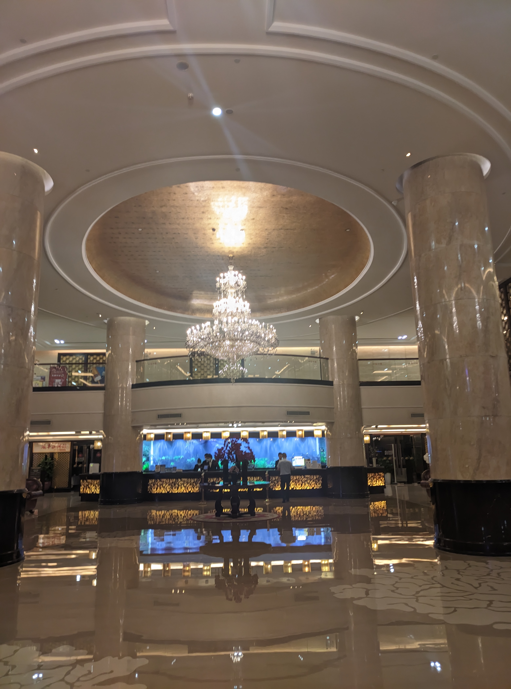

三和大神，我也是早有耳闻，不过也仅仅是局限在 NHK 的那部纪录片中。此番到了深圳，确实有很多地方可以去看看：去龙华的三和看看三和大神，再去毗邻的香港看看九龙城寨。可惜的是，我终究还是高估了自己的意愿，在后续的三个月中，烈日炎炎，只好待在自己的出租屋中，无聊时便写写代码、打打游戏、刷刷视频。甚至连近在咫尺的大海，都没有去看过一眼。

但是一直宅着也是不可能的，即使是除了上班，也还有很多的事情要做。譬如酒店入住当天下午，我就离开了酒店去处理了租房的事情。

我一共挑了两家，一家是至少叫得上名的“魔方公寓”，看了两套户型；另一家是城中村的，看了一套户型。我去看房的当天，深圳将近下了一天的雨，后几天也是如此，看了看手机上的天气预报，接下来的整整一周都要下雨，以至于让我怀疑深圳是否日日如此。在城中村看完了最后一套户型后，时间已近傍晚，我去楼下随便找了家铺子点了盘炒粉，粉量很足。直至我吃完晚饭后，雨也似乎没有消停的势头。

也就大概刚进酒店三天左右吧，我办好了退房手续，离开了宽敞的酒店，进入了那间狭小的出租屋，

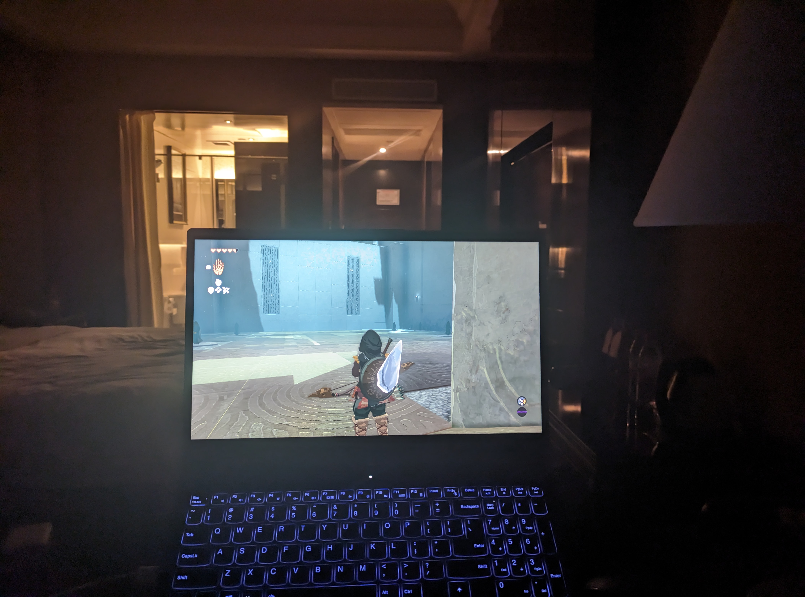
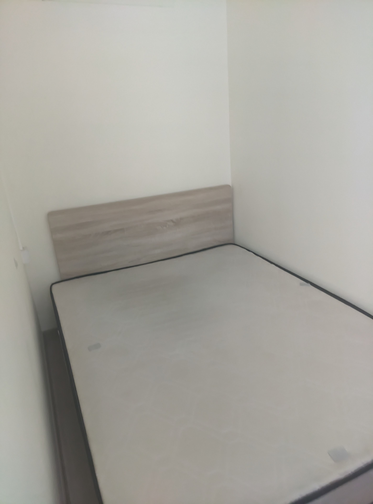

嗯...或许在你看来这出租屋似乎小得离谱，但实际上这只是因为这套户型不是常规的矩形，而这里床恰好又单独占了一角罢了。实际上大概有 20 平米左右吧。再者，我租的也不是这个房间，而是另一个面积似乎稍微更小一点的房间...

不过总之还好，至少是独居。上下班各通勤一个小时，也算差强人意。

### 印象

#### 单车

我在小学时，似乎还没有诞生共享单车这种东西。

我在中学时，整日地被禁锢在学校里，印象里，只有在高考后的那次暑假，才第一次亲手摸过共享单车。

我在大学的前三年，或许是由于重庆的地形影响，我还从来没在重庆见过一辆共享单车。

而到重庆后，终于又见到了阔别已久的平原地带。因此，自然少不了共享单车，回想起上一次骑“洋车”（我们方言中的称谓），估计还是在中学时期吧。不过这么多年没有再碰过自行车，再次上手，居然还能正常地骑出个百来米而不倒，真可谓是惊喜。

但是随后，我就不得不开始吐槽深圳的自行车了，刚来的第一天，当我步行在人行道上，就险些因为自行车而出过多次“车祸”，所幸最终都只是擦肩而过，有惊无险。但是依旧不得不感叹，深圳的“节奏”是真的快呀，就连街上的行人与单车也是如此。

#### 盲道

不出意外地，作为我国的一线城市，深圳的盲道依旧是意料之中地烂：

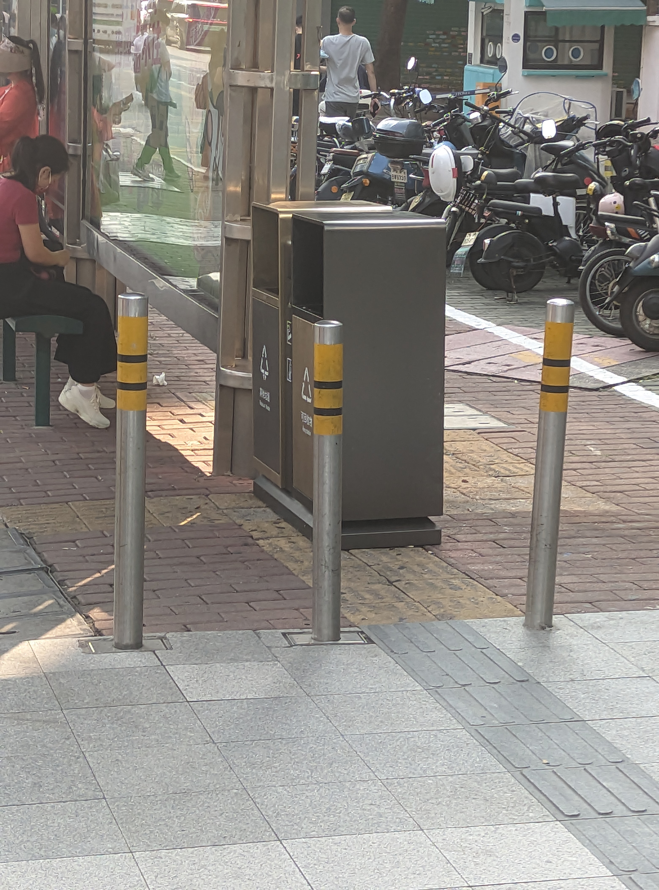

#### 光污染

小时候家住农村，供电不好，偶尔村里还会断几次电。那时的光污染还不像现在这么严重，虽然看不到银河，但至少还能看到满天繁星。但是不知从什么时候开始，天空都只是一片雾蒙蒙的黑色。而至于深圳，则更进一步地，夜空被城市的灯光照得如此通亮。

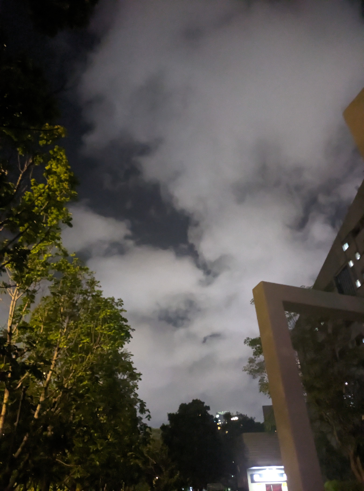

#### 海风

毕竟是沿海城市，每天晚上下班时，一出门，便能在门口感受到迎面而来的海风。海风炎热而湿润，是我未曾在别处体验过的感受。

当时还和一位与我同在滨海实习的朋友聊过，他说，海风又潮又热，你不讨厌吗？我嘛，其实倒是觉得还好，反倒是觉得它是一种独特的体验罢了。正如我曾经在上文说过的，我对气候并不是多么在意。

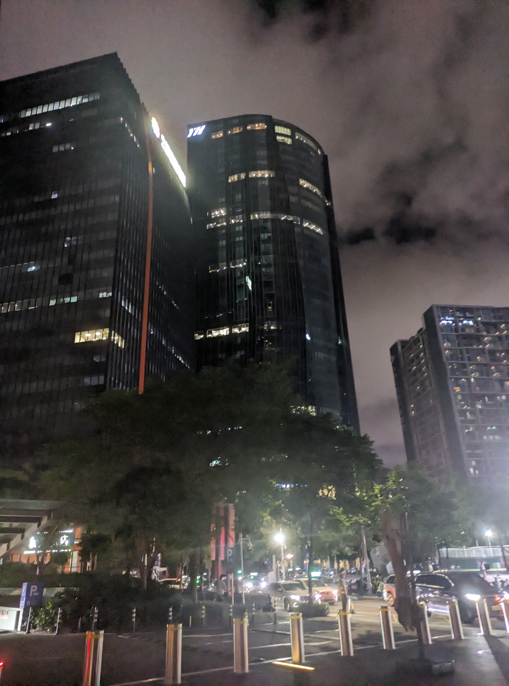

#### “奋斗”

深圳之前曾因一段鼓励 996 的广告而“闻名遐迩”。我在深圳的这几个月，虽说暂时未曾见到如此昭然若揭的宣传，但也依旧有不少奋斗相关的广告。

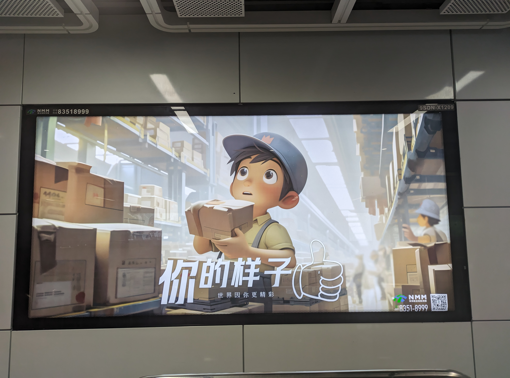
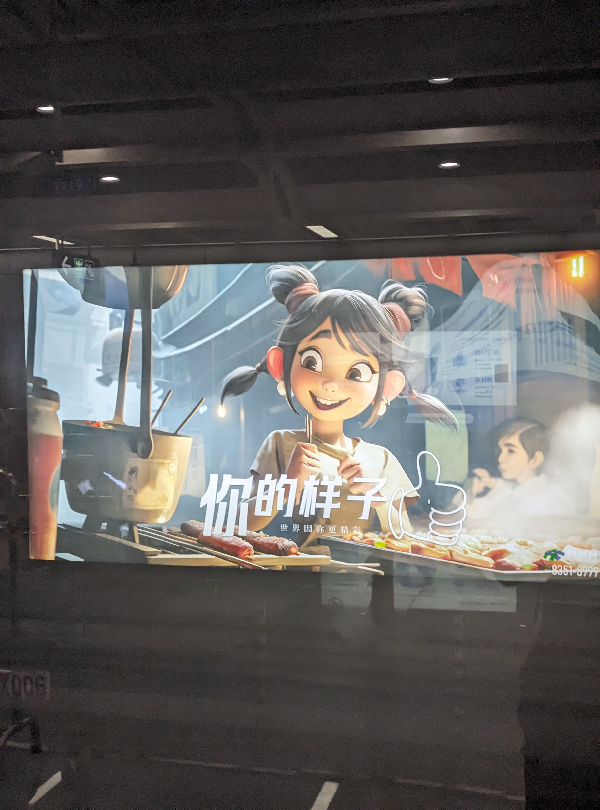

在地铁第一眼看到这幅广告牌时，我差点将其看错成“你的祥子”。

## 腾讯

作为深圳此行的目的地，腾讯自然是不可不提的。

老实说，我当初投简历的时候，还真没想到自己有一天真能迈入腾讯的大楼。毕竟今年就业形势也不好，投了十几份简历，除了腾讯收到面试邀请外，其他几乎全部石沉大海。所以从这方面而言，还是挺感谢腾讯给我的这个机会的。

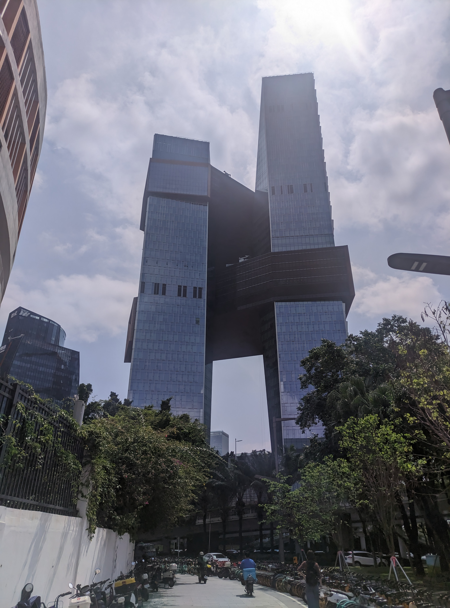

不得不说，这两座高楼中间通过廊道连接的建筑风格，很容易让人联想到《赛博朋克：2077》中的荒坂大厦。今年八月二十，正是平行世界中的强尼·银手袭击并炸毁荒坂大厦的日子。可惜的是，我们公司实行的是双休制度，今年八月二十又恰逢周日，于是当天的我只好待在出租屋里，不得亲眼目睹银手将那夜之城烧成灰。

不过还好，在离职的那一天，我选择去公司的天台去逛了逛，至少也能借此领略一番这座城市的景色。

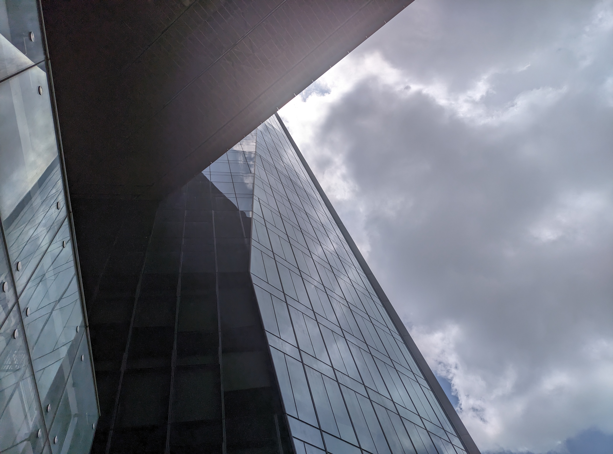

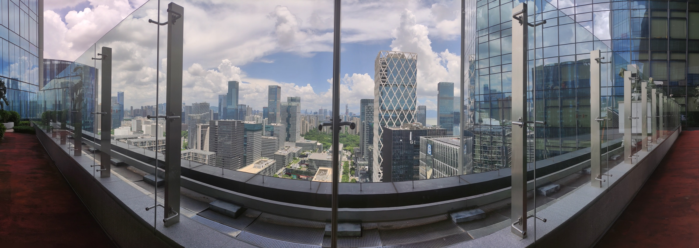

自然，我不可能每天都悠闲到在公司四处闲逛。除了偶尔朋友邀请与离职前不久的几天外，我基本都是吃完饭就回工位。中午的话大概回去蹲个坑再午睡，晚上则是直接回工位再工作上一个多小时。

公司的食堂也还是不错的，但是考虑我不怎么会拍食物，这里就简单放一张食堂的照片吧。

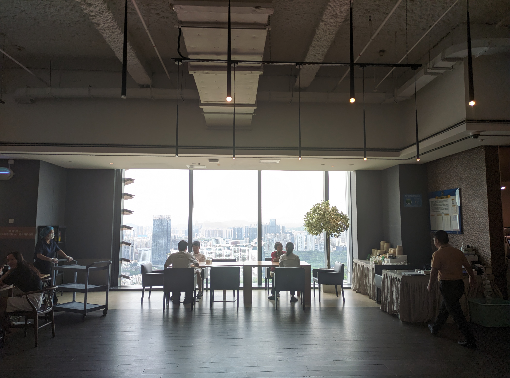

至于其他的一些地方，譬如室内攀岩、入口大厅、智能电梯、政治宣传等等，我也都多少拍过一些照片。但囿于篇幅所限，这里就不再展示了，毕竟这些地方对我而言，也并未这篇文章所体现的重点。如果只是想简单地晒一些照片，那我还不如去发空间或是 Mastodon。

## 生活

在实习的这段期间，我的作息是，定好每天七点半的闹钟，每五分钟一个，响到七点五十，起床洗漱整理后赶在八点出门，八点十五前赶上班车，在车上补个回笼觉，九点左右在班车的加速度与生物钟的联合作用下醒来，然后进入食堂，基本上每天都差不多是“皮蛋瘦肉粥 * 2 + 酸菜馅饼 * 1 + 牛奶 * 1”，如果饿的话，可能还会再加一个茶叶蛋。当然两碗粥过后剩下的牛奶肯定是喝不掉的，但是我本来也没打算当餐解决，一般都是捎走留到下午喝。就这样，吃完早饭，蹲个坑，差不多就到十点了。然后回到工位，忙到十二点，随后午饭、午休，又到下午两点，忙到六点，随后晚饭，又到七点，日常干到八点半，随后下班。就这样，等到我坐完地铁回到家，就已经九点多了。

这样算下来，每天能待在家的时间，也就不过十个小时。假设每天能有八个小时睡眠，自己可以自由支配的时间也不过两个小时。

这对我而言自然是远远不够的。

这三个月以来，我自然不可能全身心的将自己投入到工作中，因为我毕竟是人，而非机器：工作以外，我还有很多事情要做。我对语言很感兴趣，当时恰逢深入 New Ithkuil 不久，我于是开始利用空闲时间开发一款有关 New Ithkuil 的 App，命名为 Enthrirth。比较上头的那段期间，我连续好几天每天回家就立马开始开发，周末也是基本不休息全天开发。就这样，在 7 月 9 日，我发布这个 App 的 v0.1 版本，并在 reddit 进行了简单的宣传。

在后面的一个多月中，我开始着手于 v0.2 版本，这个版本变动比较大，导致我花费了将近一个半月仍没有开发完成。后面更是由于忙于准备答辩等原因，不得不暂时搁置。而与此同时，另一位与 New Ithkuil 相关的开发者，已经发布了与我 App 预期新增的功能相近的一个工具。尽管说定位有些许的区别，但这也使得当时的我觉得在这样继续开发下去的意义不大了，而这也进一步拖慢了我的开发进度和热情。从 8 月 9 日到现在，我都再没有在 Github 上进行一次 commit。

那么至于工作呢？抛弃了我的业余爱好之后，我的工作上有什么起色吗？老实说，我觉得和先前其实也区别不大。在工作的前两个月，我其实开始感受到了工作上的压力。而到了最后一个月，尤为严重。每晚下班，回到我出租屋里之后，我都是立刻打开空调，脱下衣服，随后躺在床上，什么都不想做。甚至有时电脑都不想再打开，顶多就是刷刷手机。

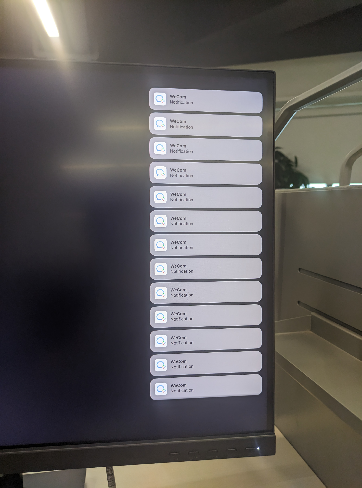

我每当心情郁结时，总会想着去写点儿东西，那时也不例外。但可惜的是，我最后发现根本没有时间写，或者说，即使像是在周末有了时间，我也实在是懒得动弹，连游戏都累得不想碰，何况去写一些东西。周末的两天时间，一天用来补觉，另一天用来缓冲休息。

我向来是不喝酒的，但是有一天我却心血来潮点了一罐。我没有当天喝，而是放在了冰箱里。离职后返校的前一两天，我拿了出来，就着快递员送来的外卖，干完了这杯苦涩的啤酒。要问我的感受，我的评价依旧是不如可乐，当初真是脑子抽了点这东西。

而这与我在实习之前所幻想的实习生活实在大相径庭。我本以为下班之后仍有自己的时间，我可以利用这段时间来学习一门新的语言，或者是有了个人空间之后有条件录制一些 New Ithkuil 的视频教程。但我却忽视了，人的精力始终是有限的，而我的精力在一天中早已在公司异化的工作中被消耗得一干二净了。

倘若只说是工作累，倒也不全是，或许更多的或许还是和人打交道的累。中国自古重视所谓的“酒桌文化“等繁文缛节，虽说在公司里我用不着喝酒，但是多少还是得整天焦头烂额地处理好和同事之间的关系。尤其是吃饭聚会的环节，对我而言就像是坐牢一般。我几乎从不玩扑克，也不喜欢 K 歌，连着扯着嗓子唱上几个小时的所谓流行歌曲，只会使我觉得聒噪，只想赶忙出门清醒一下耳朵。而且你还总得说点什么，要是不说点什么，只会显得你不合群。连忙应付完，回家后又已是深夜，躺在床上，只好随便收拾下然后睡觉，接着再等待醒来后第二天的工作。

如此的日子，这样日复一日。曾经的我，嘲笑过那些选择公务员的人，因为他们选择了一条一眼便能望到尽头的路。现在看来，我又何尝不是如此。我的日子也这样重复着日复一日的枯燥。曾经幻想的什么梦想，哪里还有时间、精力、和闲心。

刚来深圳时，还曾兴致满满的和朋友问道，要不一起约去香港玩一圈？不过最后终究没有去成。毕竟成天都还忙着上班呢，哪还有什么闲情雅致去旅游。

答辩结束后，我在完成了手头的工作之后，几乎是以最快的速度申请了离职。已经工作了三个月，当时只想能在开学之前有个一周多点的时间，好好休息休息，毕竟，这可能就是我人生中的最后一次暑假了。然而，事不遂人愿，开学时间又从预定的九月多提前到了 8 月 30 日。就这样，还没休息几天，又赶着航班回到了学校。回校的时候，本来预定的 29 号 23:00 的航班，却由于天气原因一连延迟两次，总计延迟了四个多小时。回到学校的时候，已经将近一一夜未睡。

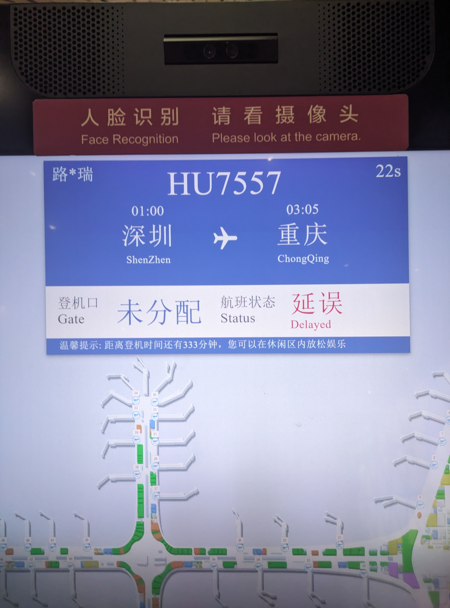
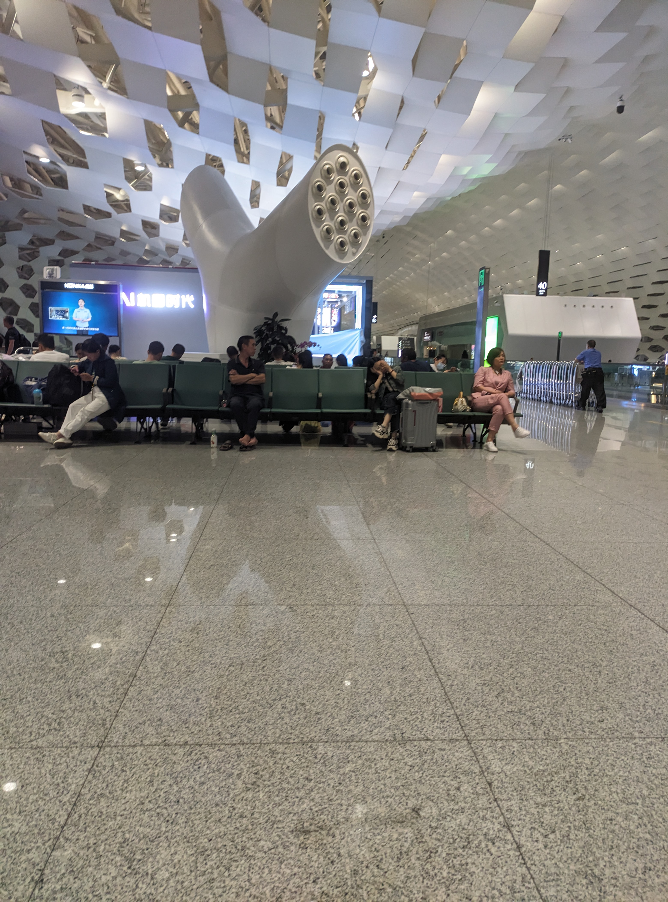
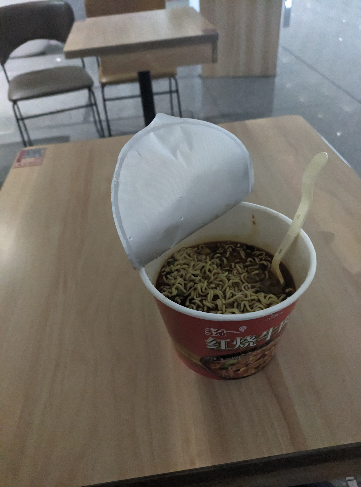

说了这么多，也该结尾了。但我实在想不到什么好的结尾。对于大众作品一般而言，我或许应该在这里来个转折，笔锋一转地用一种超脱的口吻来宣传一种积极向上的正能量。但是我觉得，我已经没有多余的精力去进行这种升华了。

如果问这段时间对于我在宏观的人生层面能有什么收获，那么我觉得，或许是借着这三个月中每个失眠的夜晚与空闲时的发呆，我又对我的人生又进行了一次梳理，我又去思考了什么才是我真正想要寻求的。

趁着大学的最后一年，读读书，看看剧，趁着两只脚还没完全地踏入职场，做些自己喜欢的事情，把自己的 to-do list 提上日程。或许这些就够了吧。

（完）