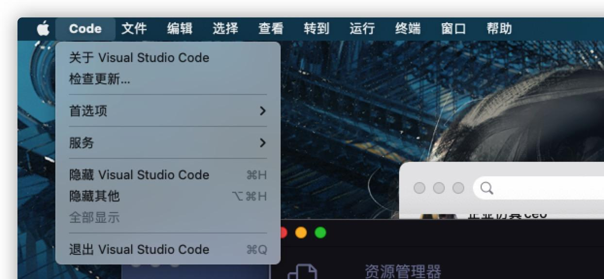
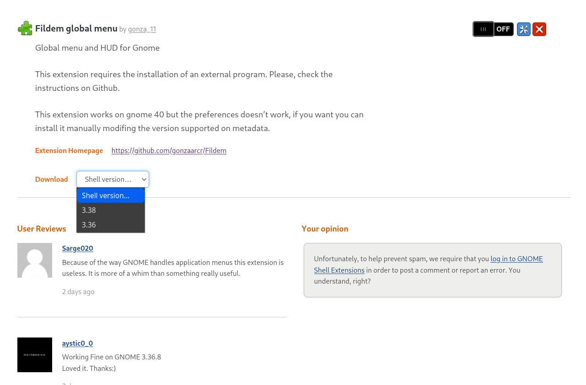
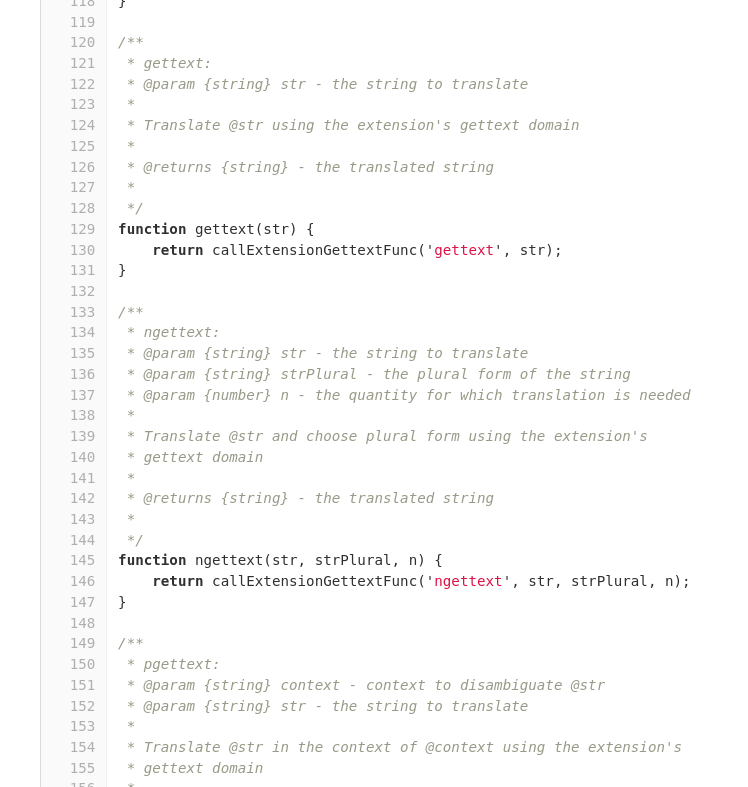

## 引子

众所周知，MacOS 有一个 global menu bar 的功能。不同于 Windows 会将 menu bar 单独置于每个窗口的 title bar 下面的设计，MacOS 则是将他们统一地放在 panel 上。这样不仅充分利用并节约了空间，也显得更加美观。



然而我用的是 Linux，桌面环境是 Gnome，默认自然是没有这种功能的。幸而 Linux 的桌面环境一般可定制化程度都比较高。对于 Gnome 来说，它也有着一套自己的插件体系。因此，我一开始试着在它的[官方网站](https://extensions.gnome.org/)上查找相关的扩展，然后就找到一款叫做 [Fildem global menu](https://extensions.gnome.org/extension/4114/fildem-global-menu/) 的扩展：



可惜的是这个扩展年久失修，并不能完美支持 Gnome40（况且我用的都是 41 了），而且体验也不怎么样。比如有时当你点击 File 目录将其展开后，再将鼠标滑动到旁边的 View 栏，并不能使当前聚焦的目录自动转移过来，导致手感及其生硬。

可我心里又始终放不下 MacOS 的 Global Menu Bar（🤤），而既然作为 Linux 用户，自然要有自己动手丰衣足食的觉悟嘛。因此我便尝试开始学习 Gnome Shell 的插件开发。

## Gnome Extension 目录结构

### 概览

经过简单地 Google 搜索后，我找到了 Gnome Extension 开发的[官方文档](https://gjs.guide/)。

下面简单介绍一下相关的基础知识。首先，一个扩展的目录下面一般是类似下面这种结构：

```
example@shell.gnome.org.zip
    locale/
        de/
          LC_MESSAGES/
              example.mo
    schemas/
        gschemas.compiled
        org.gnome.shell.extensions.example.gschema.xml
    extension.js
    metadata.json
    prefs.js
    stylesheet.css
```

其中，最重要并且也是唯二 required 的是 `metadata.json` 和 `extension.js`。

### metadata.json

```json
{
    "uuid": "example@shell.gnome.org",
    "name": "Example",
    "description": "This is an example extension.",
    "version": 1,
    "shell-version": [ "3.38", "40" ],
    "url": "https://gitlab.gnome.org/World/ShellExtensions/example"
}
```

一个 `metadata.json` 的结构就类似上面这样，但凡有点开发经验的人都能看出来每条规则代表什么意思，我这里也就不多讲废话了。如果有对哪几项不确定的，建议直接去翻官方文档的介绍：[metadata.json (Required)](https://gjs.guide/extensions/overview/anatomy.html#metadata-json-required)

### extension.js

这个是扩展的核心文件，里面需要提供三个方法：`init()`, `enable()`, `disable()`。你可以像这样提供：

```js
class Extension {
    constructor() {}

    enable() {
        log("enabled");
    }

    disable() {
        log("disabled");
    }
}

function init() {
    log(`initializing`);
    return new Extension();
}
```

也可以这样：

```js
function enable() {
    log("enabled");
}

function disable() {
    log("disabled");
}

function init() {
    log(`initializing...`);
}
```

然后接下来最让我恼火的就来了。首先，开发扩展，必然要调用相关程序提供的 API 接口，因此，我就要去阅读相关文档。然而离谱的是，Gnome Shell 的 API 根本没有文档！！！文档中给的 GNOME APIs 的[文档地址](http://devdocs.baznga.org/) 访问返回 502 Bad Gateway，页面右上角的 [API References](https://gjs-docs.gnome.org/) 也根本不是并不是我要的那些。真正的 API 在文中是这么说的：

> Here are a few links to some commonly used modules.
> 
> You can browse around in the js/ui/ folder or any other JavaScript file under js/ for more code to be reused.

然后下面给了相关链接，其中 `js/` 对应的链接是：[https://gitlab.gnome.org/GNOME/gnome-shell/-/tree/main/js/](https://gitlab.gnome.org/GNOME/gnome-shell/-/tree/main/js/)，我于是随便翻开了一个页面：



> 我翻开文档一查，这文档没有排版，歪歪斜斜的每叶上都写着“`/***/function`”几个字。我横竖睡不着，仔细看了半夜，才从字缝里看出字来，满本都写着两个字是“源码”！ 

我只能说大受震撼，我不理解，为什么它要让我直接看源码，明明我只要函数名参数返回值加注释就够了，然而加上源码之后翻起来麻烦得离谱，况且有些方法甚至都没有注释。更奇怪的是，源码中还把 private methods 暴露给了我，什么露出Play😅？（你只能眼巴巴地看着私有 API 为了遵守代码规范却又调不了气急败坏的样子真的很好笑呢~🤗）。为什么呀为什么😤？

> 我实在我也不是谦虚，我一个调 API 的怎么看源码来了呢？但是呢，gnome-shell 讲“大家已经研究决定了”，所以后来我就唸了两首诗，叫“苟利国家生死以，岂因祸福避趋之”，那么所以我就直接翻源码了

## 后续

就这样，将近过去了两周，这个项目还是没有什么进展。本来还想着能参考着一些其他扩展的源码，照葫芦画瓢，还能大体写出个样子呢。不过可能由于我只是一时兴起，开发文档又极其简陋，所以最终还是这样搁置了下去。目前的进度，倒是写出了目录栏，不过还只是写死的，还需要增加检测到焦点窗口切换时自动更新菜单栏内容的功能。所以先把源码贴一下，万一能帮到什么人呢（不过话说真的会有人接手这个屎山吗？）

```javascript
const St = imports.gi.St;
const GObject = imports.gi.GObject;
const Gio = imports.gi.Gio;
const Clutter = imports.gi.Clutter;
const Shell = imports.gi.Shell;
const WinTracker = imports.gi.Shell.WindowTracker.get_default();
const Main = imports.ui.main;
const PanelMenu = imports.ui.panelMenu;
const PopupMenu = imports.ui.popupMenu;
const Me = imports.misc.extensionUtils.getCurrentExtension();

const buttonTexts = ["File", "Edit", "Selection", "View", "Go", "Run", "Terminal", "Window", "Help"]
    .reverse();
let MenuButtons = [];

/**
 * @type {(title: string) => any}
 */
const MenuButton = GObject.registerClass(
    class PopupClass extends PanelMenu.Button {
        /**
         * @type {(title: string) => void}
         */
        _init(title) {
            super._init(0);
            this.add_child(new St.Label({
                text: title,
                y_align: Clutter.ActorAlign.CENTER
            }));

            let item = new PopupMenu.PopupMenuItem('Test');
            this.menu.addMenuItem(item);
        }
    }
)

function init() {

}

function enable() {
    for (let i = 0; i < buttonTexts.length; i++) {
        MenuButtons.push(new MenuButton(buttonTexts[i]));
        Main.panel.addToStatusArea(buttonTexts[i], MenuButtons[i], 2, 'left');
    }
    // const focusApp = WinTracker.focus_app;
    // if (!focusApp) return;
    // const focusWindow = focusApp.get_windows()[0];
    // if (!focusWindow) return;
    
    // const names = [];
    // for (let name in focusWindow) {
    //     names.push(name)
    // }
    // log(names)

    // global.display.connect('notify::focus-window', (e) => {
    //     log("focus something");
    //     log(e)
    // });
}

function disable() {
    for (let i = 0; i < MenuButtons.length; i++) {
        MenuButtons[i].destroy();
    }
    MenuButtons = []
}
```
