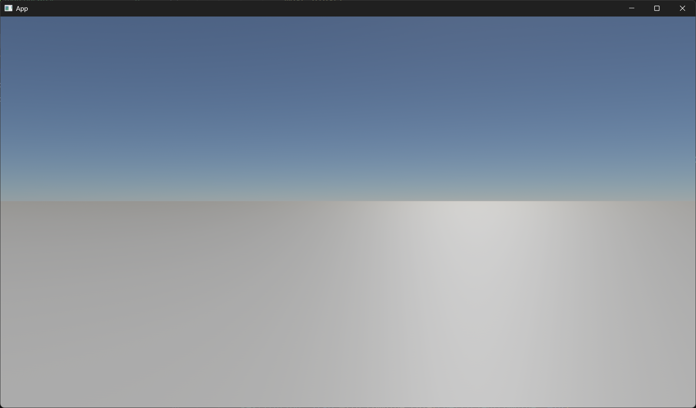
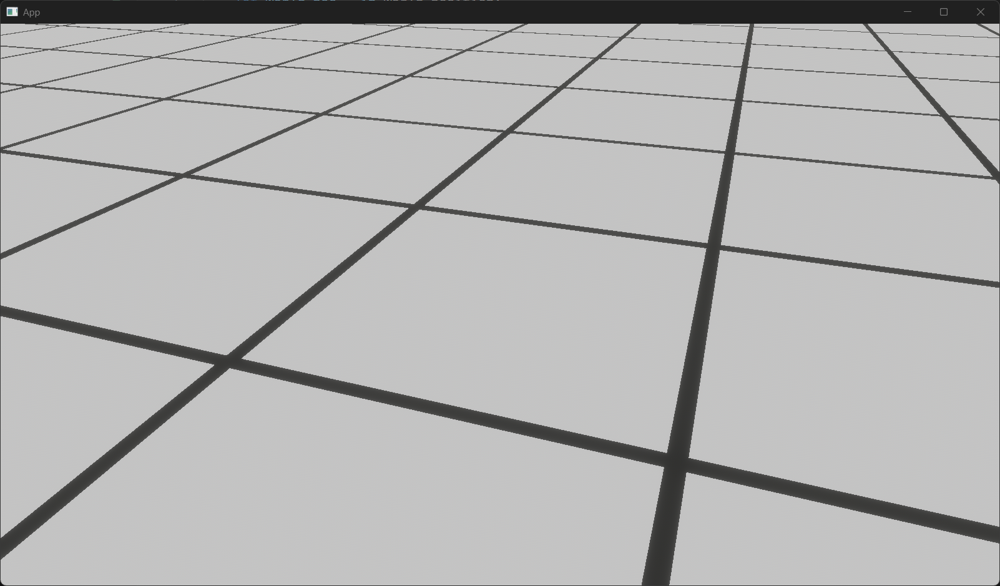
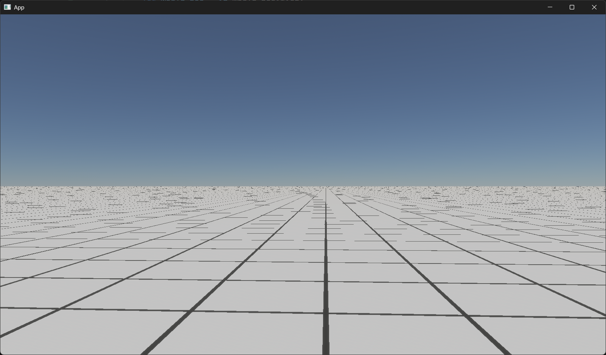
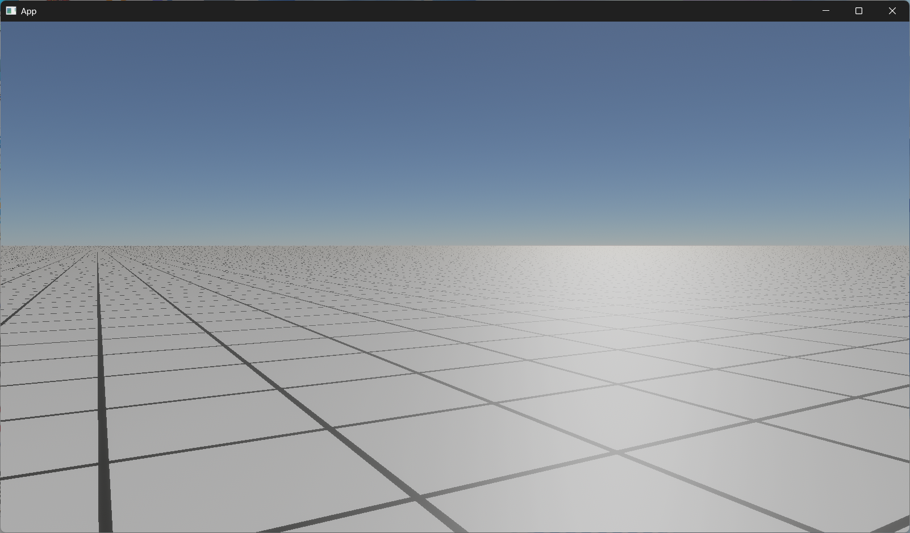
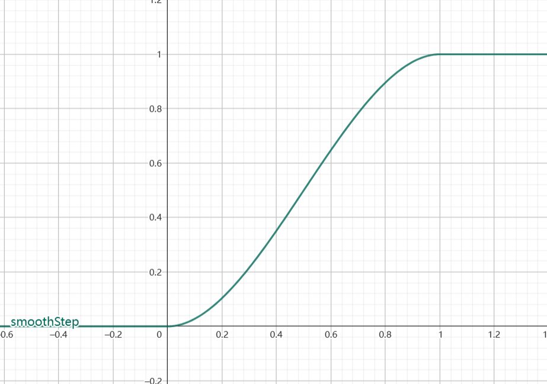
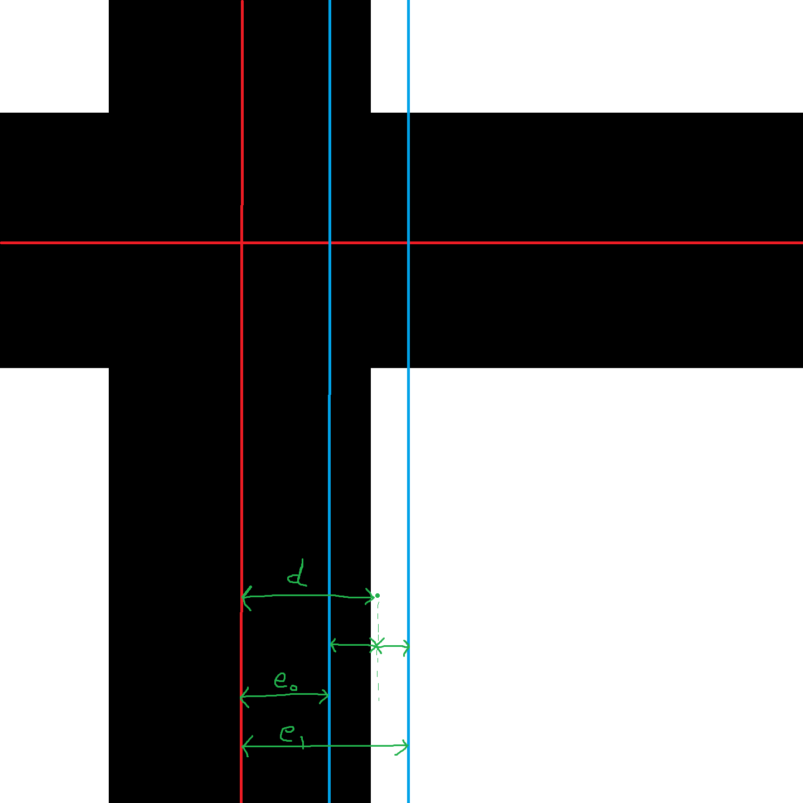
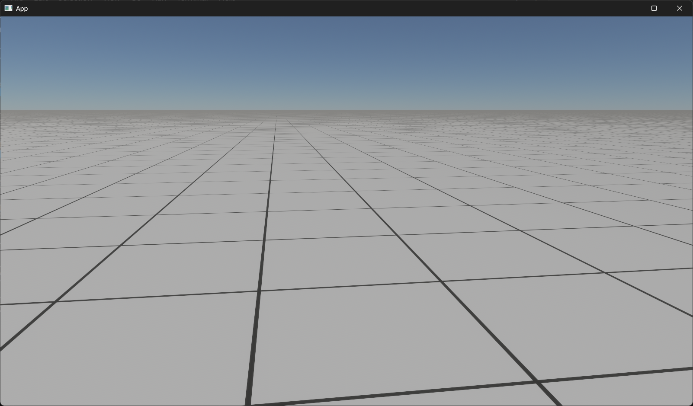
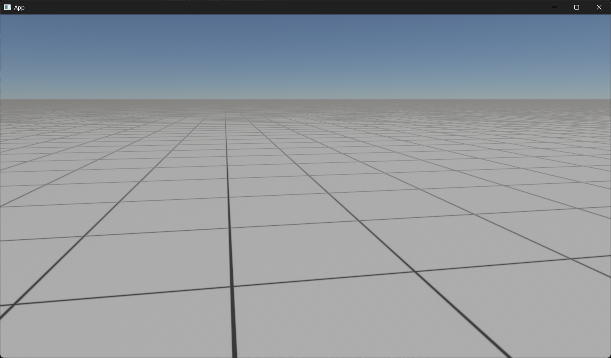
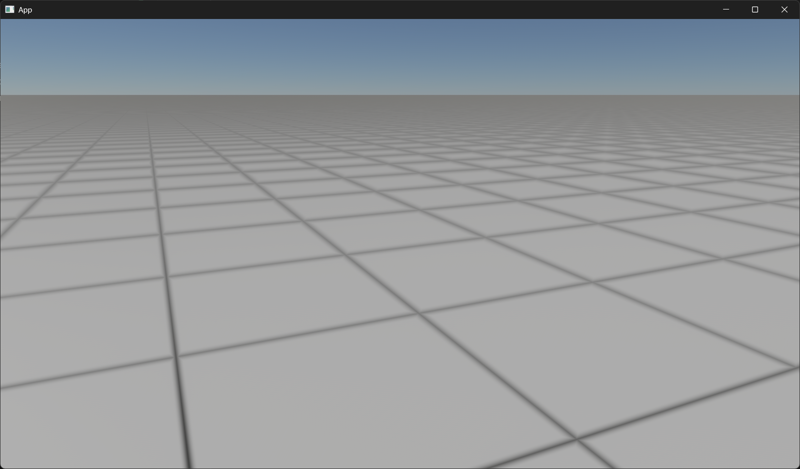

> 封面: x.com@endless_mazin

## 引子

在诸多游戏中，都存在下面这种简单的测试场景，方便游戏开发者调试开发。


在我之前使用 Bevy 开发 3D 游戏框架时，是利用 Blender 创建模型，导入简单的网格图片，并使用 Array Modifier 横纵方向不断重复贴图以生成的。

这种方法自然是简单暴力又无脑，但是也存在着诸多弊端：

- 引入额外的提及高达几百 KB 的资源文件，不够优雅
- 纹理分辨率有限，当缩放比例过高时或者距离过近时略显模糊
- 存在一定性能问题（虽然影响不大）

至于当时为啥不用单个网格模型作为基础块在游戏中用循环的方式来创建，我也忘了，可能是性能问题吧，总之时间过于久远记不太清了。当然，即使这样做，也显然不是最好的实现方式，至少根据我当前的知识，很自然地就能联想到一种更好的解决方案，那就是——

**着色器**。

## GridMaterial 实现

注：以下代码实现基于 Bevy 0.16.0，后续版本 API 可能存在变更

### 空白材质

先随便插入一个空白材质，作为后续实现的基础：

```rust
fn setup(
    mut commands: Commands,
    mut meshes: ResMut<Assets<Mesh>>,
    mut materials: ResMut<Assets<StandardMaterial>>,
) {
    commands.spawn((
        Mesh3d(meshes.add(Plane3d::new(Vec3::Y, Vec2::splat(10000.0)))),
        MeshMaterial3d(materials.add(Color::WHITE)),
    ));
}
```



### 自定义材质

对于这种图案类的材质，显然，我们应该使用片元着色器，基于像素的世界位置实现。具体到算法上，便是检测 world_position 的 x、z 坐标，如果其恰好位于线框上，则返回线框颜色，否则返回背景颜色。

我们对此可以实现以下 WGSL 代码：

```wgsl
#import bevy_pbr::forward_io::{VertexOutput, FragmentOutput}

const LINE_WIDTH: f32 = 0.02;

@fragment
fn fragment(in: VertexOutput) -> FragmentOutput {
    let world_pos = in.world_position;

    let x = fract(abs(world_pos.x));
    let z = fract(abs(world_pos.z));

    var out: FragmentOutput;

    if x < LINE_WIDTH || x > 1.0 - LINE_WIDTH ||
        z < LINE_WIDTH || z > 1.0 - LINE_WIDTH {
        out.color = vec4f(0.0, 0.0, 0.0, 1.0);
    } else {
        out.color = vec4f(1.0, 1.0, 1.0, 1.0);
    }

    return out;
}
```

将以上代码保存至 `assets/grid_material.wgsl`, 然后在 Rust 代码中，将原来的 `StandardMaterial` 替换为刚刚创建的 `GridMaterial`:

```rust
use bevy::{
    prelude::*,
    render::render_resource::{AsBindGroup, ShaderRef},
};

fn main() {
    App::new()
        .add_plugins((
            DefaultPlugins,
            MaterialPlugin::<GridMaterial>::default(),
        ))
        .add_systems(Startup, setup)
        .run();
}

#[derive(AsBindGroup, Asset, Clone, TypePath)]
struct GridMaterial {}

impl Material for GridMaterial {
    fn fragment_shader() -> ShaderRef {
        "grid_material.wgsl".into()
    }
}

fn setup(
    mut commands: Commands,
    mut meshes: ResMut<Assets<Mesh>>,
    mut materials: ResMut<Assets<GridMaterial>>,
) {
    commands.spawn((
        Mesh3d(meshes.add(Plane3d::new(Vec3::Y, Vec2::splat(10000.0)))),
        MeshMaterial3d(materials.add(GridMaterial {})),
    ));
}
```

可以看到，在近处的效果还勉强凑活，至少，效果是有了...



但是，当我们的视角落向将近地平线的远处时，效果就变得惨不忍睹了。这主要有两个原因，一是我们的着色器实现过于简陋，没有考虑 PBR 的光照等因素，二则是没有进行抗锯齿（主要原因），导致远处犬牙参差。对此，我们先对渲染层面进行优化。




### 扩展材质

我们可以参照 Bevy 提供的 `ExtentedMaterial`，它可以基于 `StandardMaterial` 等已有材质，为我们省去不必要的大量渲染逻辑：

```rust
use bevy::{
    pbr::{ExtendedMaterial, MaterialExtension},
    prelude::*,
    render::render_resource::{AsBindGroup, ShaderRef},
};

fn main() {
    App::new()
        .add_plugins((
            DefaultPlugins,
            MaterialPlugin::<ExtendedMaterial<StandardMaterial, GridMaterial>>::default(),
        ))
        .add_systems(Startup, setup)
        .run();
}

#[derive(AsBindGroup, Asset, Clone, TypePath)]
struct GridMaterial {}

impl MaterialExtension for GridMaterial {
    fn fragment_shader() -> ShaderRef {
        "grid_material.wgsl".into()
    }
}

fn setup(
    mut commands: Commands,
    mut meshes: ResMut<Assets<Mesh>>,
    mut materials: ResMut<Assets<ExtendedMaterial<StandardMaterial, GridMaterial>>>,
) {
    commands.spawn((
        Mesh3d(meshes.add(Plane3d::new(Vec3::Y, Vec2::splat(10000.0)))),
        MeshMaterial3d(materials.add(ExtendedMaterial {
            base: StandardMaterial::default(),
            extension: GridMaterial {}
        })),
    ));
}
```

之后，我们还需要修改着色器代码，否则上面这些变更也相当于完全没有效果。

```wgsl
#import bevy_pbr::{
    forward_io::{VertexOutput, FragmentOutput},
    pbr_fragment::pbr_input_from_standard_material,
    pbr_functions::{apply_pbr_lighting, main_pass_post_lighting_processing},
}

const LINE_WIDTH: f32 = 0.05;

@fragment
fn fragment(
    in: VertexOutput,
    @builtin(front_facing) is_front: bool,
) -> FragmentOutput {
    var pbr_input = pbr_input_from_standard_material(in, is_front);
    let world_pos = in.world_position;

    let x = fract(abs(world_pos.x));
    let z = fract(abs(world_pos.z));

    if x < LINE_WIDTH || x > 1.0 - LINE_WIDTH ||
        z < LINE_WIDTH || z > 1.0 - LINE_WIDTH {
        pbr_input.material.base_color = vec4f(0.0, 0.0, 0.0, 1.0);
    } else {
        pbr_input.material.base_color = vec4f(1.0, 1.0, 1.0, 1.0);
    }

    var out: FragmentOutput;

    out.color = apply_pbr_lighting(pbr_input);
    out.color = main_pass_post_lighting_processing(pbr_input, out.color);

    return out;
}
```

可以看到，此时地面能够正确反映阳光的照射了，但是仍然存在严重的锯齿问题，特别是当镜头前后移动时，锯齿更像是抽风一般地扭曲起来。



## Anti-Aliasing 实现

此处需引入几个 WGSL 函数：

### dpdx() 与 dpdy()

```wgsl	
@must_use fn dpdx(e: T) -> T
@must_use fn dpdy(e: T) -> T
```

`dpdx(e)` 会返回对窗口 x 坐标的偏导数，同理，`dpdy(e)` 则会返回对窗口 y 坐标的偏导数。

当然，如果是在数学中，当我们传入一个常数进行求导，返回的必然是一个 0。即使是在常见的编程语言中，只是传入一个常数，从理论上而言也无法求出此点的偏导数。但是在 GPU 上，情况有所不同：

> 在内部，GPU 从不会一次只运行一个像素着色器实例。在最小的粒度上，它们总是使用 SIMD 架构同时运行 32-64 个像素。在此之中，像素进一步组织成 2x2 的四边形，因此 SIMD 向量中的 4 个连续像素组对应于屏幕上的 2x2 像素块。

参见：[What does ddx (hlsl) actually do?](https://gamedev.stackexchange.com/questions/62648/what-does-ddx-hlsl-actually-do)

换句话说 `dpdx(e)` 和 `dpdy(e)` 会返回对窗口 x、y 坐标各自的变化率。通过简单的数学推导，我们很自然地就知道，如果我们要求此坐标在屏幕空间上整体的变化率，只需求出其**欧几里得距离**即可，即:

$$
d(p) = \sqrt{d(x)^2+d(y)^2}
$$

### fwidth()

然而上述计算过于消耗性能，在实际开发中，我们更常用以下方式进行近似计算：

$$
d(p) \approx |d(x)| + |d(y)|
$$

即 x 与 y 的**曼哈顿距离**。

而在 WGSL 中，则提供了以下函数：

```wgsl
@must_use fn fwidth(e: T) -> T
```

`fwidth(e)` 等价于 `abs(dpdx(e)) + abs(dpdy(e))`.

### smoothstep()

```wgsl
@const @must_use fn smoothstep(
    edge0: T,
    edge1: T,
    x: T
) -> T
```

`smoothstep(edge0, edge1, x)` 返回 0 到 1 之间的平滑 Hermite 插值结果。

- 当 `T` 为向量时，按分量计算。
- 当 `T` 为标量时，按以下规则计算：

$$
s(e_0, e_1, x) = t^2(3-2t)
$$

其中 $t$ 满足：

$$
t = saturate(\frac{x-e_0}{e_1-e_0})
$$

为便于理解，以下展示 smoothstep 关于 t 的函数图像：



可以看到，其创建了一个从 0 到 1 的渐变映射。因此我们可以利用此函数在黑白过渡处添加平滑效果。

### 实现思路



对于一个点 p，我们可以计算其距离 x 方向网格线的最短距离，其两侧都可能有网格线，因此我们两个需要计算，然后取最小值（结果对应示意图中的 $d$）：

```wgsl
let dist = min(fract(abs(coord)), 1.0 - fract(abs(coord)));
```

点 p 向两侧各延伸半个 `fwidth()`,可得图中蓝线，进而计算出 $e_0$ 和 $e_1$.

```wgsl
let edge0 = LINE_HALF_WIDTH - filter_width * 0.5;
let edge1 = LINE_HALF_WIDTH + filter_width * 0.5;
```

利用 `smoothstep(edge0, edge1, x)` 函数，我们可以计算出点 p 处的 `intensity`。进而利用 `intensity` 进行线性插值对颜色进行平滑处理：点 p 越靠近 $e_0$，其 `intensity` 越高，进而呈现黑色；点 p 越靠近 $e_1$，其 `intensity` 越小，进而呈现白色；而在两者之间时，则会根据距离取得最合适的灰度。

```wgsl
pbr_input.material.base_color = mix(vec4f(1.0, 1.0, 1.0, 1.0), vec4f(0.0, 0.0, 0.0, 1.0), intensity);
```

需要注意的是，点 p 距离 x 方向的网格线的最小距离和点 p 距离 z 方向的网格线的最小距离可能差距很大，因此我们需要分别计算，然后取两者的最大值。

```wgsl
let intensity_x = line_intensity(world_pos.x);
let intensity_z = line_intensity(world_pos.z);

let intensity = max(intensity_x, intensity_z);
```

实现效果如下：



### 调整抗锯齿强度

尽管效果好了不少，但是在远处仍在相对轻微的锯齿问题，对此我们可以新增一个过渡因子的参数，调高它以使得过渡处更加平滑。但是也要注意数值不能取太大，贪多嚼不烂，不然就会像第二张一样模糊了...

```wgsl
const TRANSITION_FACTOR: f32 = 1.0;

fn line_intensity(coord: f32) -> f32 {
    /// ...

    let filter_width = fwidth(coord) * TRANSITION_FACTOR;

    /// ...
}
```




在个人体感上，TRANSITION_FACTOR = 4 是相对合适的取值。

最终代码如下：

```wgsl
#import bevy_pbr::{
    forward_io::{VertexOutput, FragmentOutput},
    pbr_fragment::pbr_input_from_standard_material,
    pbr_functions::{apply_pbr_lighting, main_pass_post_lighting_processing},
}

const LINE_WIDTH: f32 = 0.02;
const LINE_HALF_WIDTH: f32 = LINE_WIDTH / 2.0;
const TRANSITION_FACTOR: f32 = 1.0;

fn line_intensity(coord: f32) -> f32 {
    let dist = min(fract(abs(coord)), 1.0 - fract(abs(coord)));
    let filter_width = fwidth(coord) * TRANSITION_FACTOR;

    let edge0 = LINE_HALF_WIDTH - filter_width * 0.5;
    let edge1 = LINE_HALF_WIDTH + filter_width * 0.5;

    let line_intensity = smoothstep(edge1, edge0, dist);

    return line_intensity;
}

@fragment
fn fragment(
    in: VertexOutput,
    @builtin(front_facing) is_front: bool,
) -> FragmentOutput {
    var pbr_input = pbr_input_from_standard_material(in, is_front);
    let world_pos = in.world_position;

    let intensity_x = line_intensity(world_pos.x);
    let intensity_z = line_intensity(world_pos.z);

    let intensity = max(intensity_x, intensity_z);

    pbr_input.material.base_color = mix(vec4f(1.0, 1.0, 1.0, 1.0), vec4f(0.0, 0.0, 0.0, 1.0), intensity);


    var out: FragmentOutput;

    out.color = apply_pbr_lighting(pbr_input);
    out.color = main_pass_post_lighting_processing(pbr_input, out.color);

    return out;
}
```

## 收尾

目前抗锯齿效果基本上达到我的要求了，但是也还仍然存在一些小问题，比如远处网框存在摩尔纹的问题。考虑到这个问题的复杂度也比较高，就暂时不在本文继续修改了，以后有空再解决。

后续：发现了 Ben Golus 的一篇关于生成网格材质的文章，写的很好，实现也比我的要好，不过是用的 Unity Shader 实现的，我将其翻译为 WGSL 贴在下面：

```wgsl
#import bevy_pbr::{
    forward_io::{VertexOutput, FragmentOutput},
    pbr_fragment::pbr_input_from_standard_material,
    pbr_functions::{apply_pbr_lighting, main_pass_post_lighting_processing},
}

struct GridMaterial {
    line_width: f32,
    square_width: f32,
}

const LINE_COLOR: vec4f = vec4f(0.0, 0.0, 0.0, 1.0);
const BACKGROUND_COLOR: vec4f = vec4f(1.0, 1.0, 1.0, 1.0);

@group(2) @binding(100)
var<uniform> grid_material: GridMaterial;

fn line_intensity(coord: f32, coord_derive: f32) -> f32 {
    let line_width: f32 = saturate(grid_material.line_width);
    let invert_line: bool = line_width > 0.5;
    let target_width = select(line_width, 1.0 - line_width, invert_line);
    let draw_width: f32 = max(target_width, coord_derive);
    let line_aa: f32 = max(coord_derive, 0.000001) * 1.5;
    var dist: f32 = abs(fract(coord) * 2.0 - 1.0);
    if !invert_line {
        dist = 1.0 - dist;
    }
    var intensity: f32 = smoothstep(draw_width + line_aa, draw_width - line_aa, dist);
    intensity *= saturate(target_width / draw_width);
    intensity = mix(intensity, target_width, saturate(coord_derive * 2.0 - 1.0));
    if invert_line {
        intensity = 1.0 - intensity;
    }
    return intensity;
}

@fragment
fn fragment(
    in: VertexOutput,
    @builtin(front_facing) is_front: bool,
) -> FragmentOutput {
    var pbr_input = pbr_input_from_standard_material(in, is_front);

    let pos: vec2f = in.world_position.xz;
    let dpos: vec4f = vec4f(dpdx(pos), dpdy(pos));
    let intensity_x: f32 = line_intensity(pos.x, length(dpos.xz));
    let intensity_y: f32 = line_intensity(pos.y, length(dpos.yw));
    let intensity: f32 = mix(intensity_x, 1.0, intensity_y);

    pbr_input.material.base_color = mix(
        BACKGROUND_COLOR,
        LINE_COLOR,
        intensity
    );

    var out: FragmentOutput;

    out.color = apply_pbr_lighting(pbr_input);
    out.color = main_pass_post_lighting_processing(pbr_input, out.color);

    return out;
}
```
