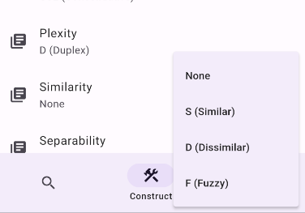

## 背景

今天在写 Enthrirhs（一个 Flutter 项目）时，遇到了这样一个问题：

首先，我前面声明了一个枚举 `Similarity`：

```dart
enum Similarity {
  /// The Similar Similarity
  s,

  /// The Dissimilar Similarity
  d,

  /// The Fuzzy Similarity
  f;
}
```

我创建了一个 `PopupMenuButton`，它有四个选项，其中三项是 `Similarity` 的枚举值，最后一个是 `null`，同时也是默认值。



去除部分无关逻辑后的代码如下：

```dart
import 'package:flutter/material.dart';
import '../../libs/ithkuil/mod.dart';
import '../../libs/ithkuil/terms/mod.dart';

class FormativeEditor extends StatefulWidget {
  final Formative formative;
  final void Function(void Function(Formative)) updateFormative;
  final void Function() removeFormative;

  const FormativeEditor({
    required this.formative,
    required this.updateFormative,
    required this.removeFormative,
    super.key,
  });

  @override
  State<FormativeEditor> createState() => _FormativeEditorState();
}

class _FormativeEditorState extends State<FormativeEditor> with TickerProviderStateMixin {
  @override
  Widget build(BuildContext context) {
    return ListView(children: [
      widget.formative.configuration.plexity != Plexity.u
          ? PopupMenuButton<Similarity?>(
              initialValue: widget.formative.configuration.similarity,
              onSelected: (Similarity? newSimilarity) {
                widget.updateFormative((f) {
                  final plexity = widget.formative.configuration.plexity;
                  final similarity = widget.formative.configuration.similarity;
                  if (similarity == null && newSimilarity != null) {
                    widget.formative.configuration =
                        Configuration.from(plexity, newSimilarity, Separability.s)!;
                  } else if (similarity != null && newSimilarity == null) {
                    widget.formative.configuration =
                        Configuration.from(plexity, newSimilarity, null)!;
                  } else {
                    widget.formative.configuration.similarity = newSimilarity;
                  }
                });
              },
              offset: const Offset(1, 0),
              itemBuilder: (BuildContext context) => const <PopupMenuEntry<Similarity?>>[
                PopupMenuItem(
                  value: null,
                  child: Text('None'),
                ),
                PopupMenuItem(
                  value: Similarity.s,
                  child: Text('S (Similar)'),
                ),
                PopupMenuItem(
                  value: Similarity.d,
                  child: Text('D (Dissimilar)'),
                ),
                PopupMenuItem(
                  value: Similarity.f,
                  child: Text('F (Fuzzy)'),
                ),
              ],
              child: ListTile(
                leading: const Icon(Icons.library_books),
                title: const Text("Similarity"),
                subtitle: Text(
                  switch (widget.formative.configuration.similarity) {
                    Similarity.s => 'S (Similar)',
                    Similarity.d => 'D (Dissimilar)',
                    Similarity.f => 'F (Fuzzy)',
                    null => 'None'
                  },
                  style: TextStyle(
                    color: Theme.of(context).colorScheme.onSurfaceVariant,
                  ),
                ),
              ),
            )
          : Container(),
    ]);
  }
}
```

### 问题一：所谓“空安全问题”

但是在写代码的时候，我就隐约注意到了一点端倪。其实起初，对于这个组件的泛型参数，我写的是 `PopupMenuButton<Similarity>`，没有考虑实际上这里的 `similarity` 可为空，但是当我对其选项的 `value` 属性赋 `null` 值时，发现它居然并没有报错：

```dart
<PopupMenuEntry<Similarity>>[
    PopupMenuItem(
        value: null,
        child: Text('None'),
    ),
    PopupMenuItem(
        value: Similarity.s,
        child: Text('S (Similar)'),
    ),
    PopupMenuItem(
        value: Similarity.d,
        child: Text('D (Dissimilar)'),
    ),
    PopupMenuItem(
        value: Similarity.f,
        child: Text('F (Fuzzy)'),
    ),
],
```

但我随后不久就意识到了这个问题，并将其改为了 `PopupMenuButton<Similarity?>`，当时只是觉得 Flutter 的开发团队疏忽，导致这个组件没有实现空安全。我对此也没太细想，就继续写我的代码了。

### 问题二：无法实现对 null 的选择

但是在随后的测试中发现，如果选中其中三个任意枚举选项，则 `similarity` 可以正常修改，但是当选中 None（`null`）时，却不能如同预期那样触发相关数据的更新。简单通过打断点排查之后，发现之所以没有正常更新数据的原因是因为组件的 `onSelected()` 并没有被触发。

而这时再考虑到前面所提到的问题一，我于是很难不去猜想这是这个组件本身的 bug。就这样，我去给 Flutter 提了一条 issue：<https://github.com/flutter/flutter/issues/139663>.

### 问题三：“null 中 null” 的表示

但是提完 issue 后，我突然联想到了 JavaScript 中的 `prompt()` 函数，这个函数被调用时会弹出一个对话框，当你在其中输入一些文字并点击“确认”后，这个函数就会返回你所输入的字符串；如果你只是点击了“取消”，它则会返回 `null`。我开始思考：不会 Flutter 中的这个组件也是类似的原理，即如果选中了 `null` 就类似于 `prompt()` 中点击了“取消”，所以才不会触发 `onSelected()` 吧？

我于是去扒了下 Flutter 中的相关源码：

```dart
class PopupMenuButtonState<T> extends State<PopupMenuButton<T>> {
  void showButtonMenu() {
    /* ... */
    final List<PopupMenuEntry<T>> items = widget.itemBuilder(context);
    if (items.isNotEmpty) {
      widget.onOpened?.call();
      showMenu<T?>(
        /* ... */
      )
      .then<void>((T? newValue) {
        if (!mounted) {
          return null;
        }
        if (newValue == null) {
          widget.onCanceled?.call();
          return null;
        }
        widget.onSelected?.call(newValue);
      });
    }
  }
}
```

结果发现果真如此，如果选中了 `null`，组件就会以为用户没有进行选择，从而触发“取消”事件并跳过“选中”事件。于此同时，前面的问题一也迎刃而解了————与其说这是 bug，不如说是 feature，毕竟是开发者故意为之的操作。

## 如何解决？

尽管我已经知道了这里是开发者故意为之，但问题毕竟确实存在着，总归是要解决的。开发者这么做或许是没有考虑到这种使用场景，抑或是不得已而做的妥协。而如果是开发者的妥协，那难道说就没有更好的办法可以解决这个问题了吗？

### 解决不了 `null`，就去解决提出问题的枚举

最直接的方法，为 `Similarity` 新增一个属性用来表示 `null`，并将此变量由可选改为必选：

```dart
enum Similarity {
  /// The Similar Similarity
  s,

  /// The Dissimilar Similarity
  d,

  /// The Fuzzy Similarity
  f,
  
  /// null
  none;
}
```

但是不得不说，这样子实在太不语义化了。我很不喜欢，所以还是想想其他的办法吧。

如果我用的是其他语言，我会怎么做呢？

### 双生的 `undefined` 与 `null`，赘余却可行

在 JavaScript 中，有两种表示空的基本类型：`undefined` 与 `null`。那么很自然地就可以想到，如果说开发者提供的 API 是用 `null` 来判别用户是否进行了选择，那我这里用 `undefined` 来表示空就可以避开冲突了。

这种方法很简单，但很不优雅。而且有这么两个近义词表示空，不得不说实在是太过冗余。再者，如果我需要两个以上表示空的变量怎么办呢？

### `Option<T>`，还得是 Rust

之前写 Dart 的时候就经常想，这语言真是又丑陋、又啰嗦、又残疾，日夜心心念念地想用 Rust 重构。而对于这个问题，我还真别说，Rust 确实照样管用：

```rust
let a: Option<Option<i32>> = Some(Some(1));
let b: Option<Option<i32>> = Some(None);
let c: Option<Option<i32>> = None;
```

我觉得这里已经不言自明了。

至于这个项目的解决方案嘛，那就自己用 Dart 实现一个 Option 吧~