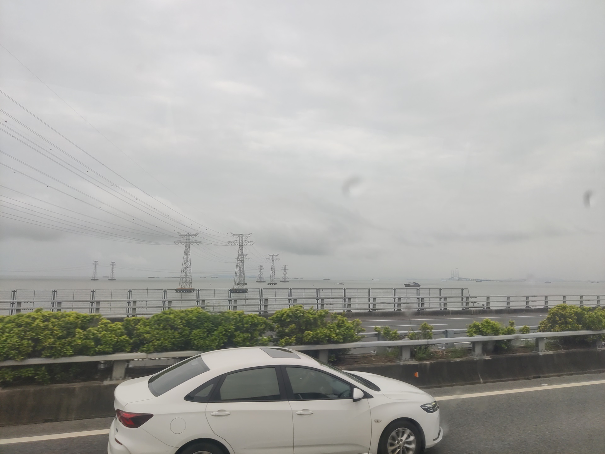
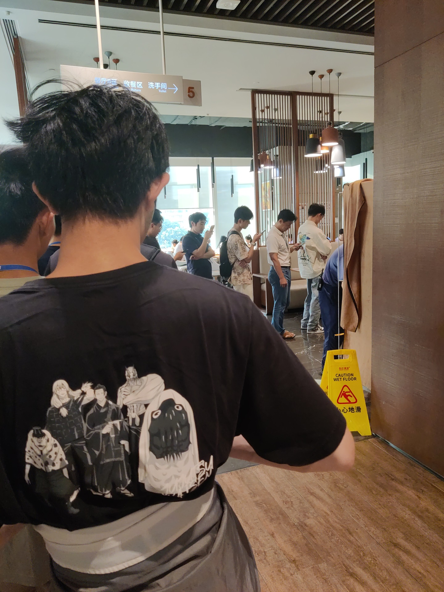
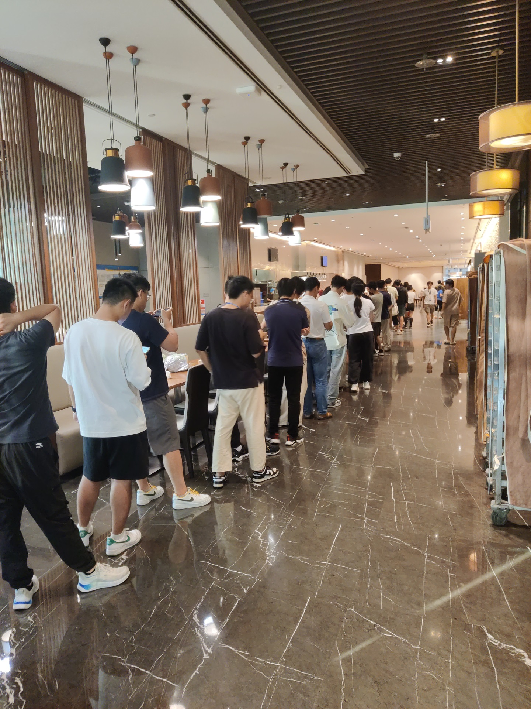

## 正文

这周公司有一个校招生的新人培训。起初我对这次封闭培训并没有什么太高的期望，以为就是普通地待在教室里，听着老师照本宣科地讲着PPT，这很自然地使我想起大学时的诸多课程经历，又或者是说，正是大学时长久的这些课程经历，使我对于培训一词产生了这种印象。但直到培训的最后一天，我才意识到，与其将其比作大学，事实上，它反而令我想起了刚进网校时的那段经历。

我是在周二从滨海坐上了前往希尔顿酒店的班车的。当天是2024年8月20日，也正是《黑神话：悟空》正式发布的日子，而我也正是因此而在自己的QQ空间调侃了一句“唉，腾讯打压”————毕竟本来预想的是在家里用着高档的主机与屏幕配置畅玩来着，只可惜培训时间就安排在了从820当天开始后的一周，终是无可奈何。

在班车上坐的时间还是挺久的，在车上除了和朋友在手机互相聊天，看着车窗外的隧道、山峦变化，也是别有一番风味。我们的路线在我印象中应该是往北行驶的，不过不知为何路上似乎还是看到了海。但不管怎样，这也应该是是我第一次看到海了，虽说算不上是是近距离观看，但多少也依旧是有些震撼的。

培训的第一天，自然是要先有个全体的开业典礼，然后便是班内的活动，包括班主任的自我介绍，与同学们之间的互相结识。当天班主任有说过一句话：“这可能是你们最后一次能以班级的形式所参加的活动了，所以一定要好好珍惜呀”，当时我可能不以为意，后面回想时却感觉记忆犹深。

整个培训期间，我都是在酒店度过的，包括上课、休息、就餐。培训期间的作息一般是早上九点上课，晚上六点下课，午休差不多两个小时，可以算是 WLB 的 965 生活了，况且还不需要再考虑通勤的耗时，毕竟衣食住行都只是在酒店内嘛。晚上的自由时间同上班时相比，自然是充裕了许多，但是我却始终难以放松，一是培训期间我还在一直想着 WXG 公益第一课要求我去做的海报传单要去尽快完成，二是课后有些小测试或是其他杂事要做。尽管在这五天的历程中，我实际上并没去制作海报，课后的小测试也并不耗时，但是由于这些琐事的缠身，紧张心态却始终每每地伴随着我的休息时间。培训的第一天晚上我就安装好了《黑神话：悟空》，也自然游玩了一段时间，但当时的游玩心态却还是难以放松。后面和组内的一位朋友聊到，才知他下周就要转正答辩了，还得去做答辩的 PPT，他的压力想必自然是比我的更大吧。不过在最后，我和他其实都一样，都还是选择暂时放弃了这些无用的压力，尝试以更加放松的心态面对这余下的这段时光。

培训的第四天晚上，我和几位组内的朋友去玩了桌游。我平常其实是很少有机会能够和朋友一起玩桌游的，只记得上次和朋友玩桌游还是在网校的时候，我忘了当时到底具体是何时，但是我当时好像是被朋友拖过去的，玩的似乎是和什么航海有关的桌游。当记忆再尝试往上追溯，我便发现我似乎没有更多的这种记忆了。网校曾经有过一次“轰趴”，只是当时不巧，我恰逢感冒，于是在大家晚上唱K、观影之际，我便早早地回房休息了，至于当天大家有没有玩什么桌游，我自然是一概不知。不过这对我而言也并非全然坏事，因为彼时的我或许依然难以适应这种群体性的而又嘈杂困倦（因为是在晚上）的活动。而回到今晚，也许是我与人相处的心态在这几年中变得更加坦然了，也可能是不想错过封培的最后一段记忆，我这次几乎是主动地同朋友们去了。虽然游戏本身的游戏性如同你画我猜一般普通，但实际上玩得还是挺开心的。

另外还令我想要多提一嘴的是第五日上午的[拆弹专家](https://store.steampowered.com/app/341800/Keep_Talking_and_Nobody_Explodes/)游戏，简单来说，是一款类似《胡闹厨房》或者《双人成行》那样的多人合作游戏（当然了，这几款我都没玩过，上次玩这种多人游戏都是小学时和朋友玩 4399 了），我们的游玩方式就是组内8人合作拆弹。但是要详细讲讲的话，好像也没什么好写的，就先介绍到这儿吧。

最后一天的结业典礼上，有几位同学上去表演了个舞蹈节目，名叫《去班味儿》，意思是经过了这几天培训，我们都去除了“班味”。这话说得着实不错，尽管只有短短几天的时间，但它让我找回了自己曾经刚刚进入大二时，和朋友们在网校一起工作、游戏、互相商业互吹、调侃的那段时光。自从大三换了工区之后，不少朋友都从网校中半退休了，去往网校的熟悉的身影也变少了。而到了我大四实习归来，我就只是零星地去过几次网校，里面已尽然是些我所不太熟悉的面孔了。

我感觉我在实习之后，就已经染上了“班味”了。刚开始上班的那段时间，我依然乐于在下班后为了我所热爱的开源事业或者业余爱好而不知疲倦的工作。但不知是从何时开始，或许是在实习结束前忙着准备答辩的那几周之后吧，我似乎对梦想丧失了动力。我在之前的[文章](https://lomirus.github.io/p/from-chongqing-to-shenzhen/)中也应该有提到过，而在此后的整个大四，就我个人而言，似乎没有什么能够特别让我铭记的事情。哦，我好像在这段时间通关了伊苏8，然后呢，我实在想不出来————我似乎是虚度了一年。正式工作后，这种情况依然没有好转，尽管我甚至至今都没用过抖音快手，但我的业余生活却似乎依然是被碎片化的时间所充斥。

但不得不承认，这短短的几天，却让我短暂地想起了我那未曾被“班味”所沾染时的状态。自从工作之后，我便觉得时间过得特别快，一周什么正事儿也没做就没了，几个月也是转眼间就过去了。有人说，快乐的时光总是短暂的，痛苦的才是长久的。但我的感受确是与此相反：或许是我的大脑的防御机制会自动为我屏蔽掉那些无聊的时段吧，我反而觉得充实的时光才是深刻而醇久的，沉闷而无趣的时光才是倏然而已。正如这培训的五天，体感上的时长却远胜过我正式工作已来的一个多月。

但别误会，我并非想说我会因此而打了鸡血，从此重拾梦想，不忘初心，砥砺前行————毕竟我还是有些自知之明的。实际上，当她们在舞台上展示出那个节目名的时候，我就向着旁边的朋友开玩笑说，“说得确实，不过等下周再回去干几天活儿，我们的班味儿就又回来了”。

周五培训完，我们坐上班车回到了滨海大厦。组里的三个人先走了，剩下我们五个，吃了最后一顿饭。席间我们聊了不少，聊了当前工作的一些压力，聊了些未来规划，半开玩笑地说着被“优化”后去找什么着落。我们几位其实年龄差距还挺大的，大多是硕士，还有一位博士，而我则是其中算是少数的本科生。朋友说按我的年龄，将来的选择还有很多。实际上或许确实如此，但我已经懒得再去考研或是留学了，我不觉得这些和工作之间有什么本质的差别，至少工作还能给我发工资。饭后我们就散了，我不知道我们以后还会不会再见。培训期间我们整个班里有许多人互相加了微信，第三日我们畅谈了一晚，有人讲述了自己旅行时车子深陷沙漠、被中东士兵持枪威胁的惊险旅程，有人讲述了自己年少时因游戏而遇到的爱情故事（虽然最后并没有想象中的 GOOD END），也有人讲述了自己的业余爱好，从猫猫狗狗，乃至无线电与飞行模拟，似乎每个人都拥有一个独属于他的小世界。我也加了其他不少人，可是说实话，我觉得我们之间的大多数，除了互相加上微信之外，可能整个余生都没有更多的交集了，想到这里还难免有些遗憾，~~尤其是还加了不少妹子的微信~~。但这也难免，毕竟小学五年的朋友，至今不也是没有联系了吗，又何况是五天的泛泛之交呢。释然，也只能释然。

这几天看了一些杨奇当年的采访，我发现我和他当时的心态挺像，都是一种年岁已高而功名为就的遗憾。虽然客观上我的年纪哪怕是在同龄的校招生中都算是年轻的了，但我始终都将这当作是心理安慰。我总是会想起《三国志》中刘备的一句话：

> 吾常身不离鞍，髀肉皆消。今不复骑，髀里肉生。日月若驰，老将至矣，而功业不建，是以悲耳。

大概就是这种心态吧。

## 后记

这篇文章本来还是想继续写下去的，但是由于周六晚上才回家，周日也是忙了一天，导致时间太赶，这篇文章只是在周日晚上简单写了写。后面一周都比较忙~~着玩黑猴~~，所以就一直没继续写。直到周末又再次有了时间，但是当时的心境也没了，现在又回复到了那种平常的只想摆烂的状态，也算是对我前文的所做的描述完美印证吧，所以仍是没有继续写下去，只是简单加了几张配图。

封培期间没留多少照片，本文封面还是用的群友发的，因此基本没啥配图。

时间有限，写得比较随便，因此也自然没什么章节目录安排，观者图一乐即可。